# Edge Devices Real-time Data Pipeline


## Project Overview

The Edge Devices Real-time Data Pipeline is a distributed video streaming and processing system built on Apache Kafka architecture. This system captures video streams from edge devices (IP cameras), processes them in real-time, and distributes the data to multiple consumers for various processing and storage purposes.

### Key Features

- **Real-time Video Streaming**: Captures and processes video frames at 30 FPS from IP cameras
- **Distributed Architecture**: Multi-broker Kafka cluster with ZooKeeper coordination
- **Multiple Data Formats**: Supports both binary JPEG and JSON+Base64 encoded video data
- **Fault Tolerance**: 3-node ZooKeeper ensemble with automatic failover
- **Scalable Processing**: Multiple consumer applications for different use cases
- **Comprehensive Monitoring**: Detailed logging and performance metrics

---

## System Architecture

```mermaid
graph TB
    subgraph "Edge Device Layer"
        CAM1["📹 Lab Camera\n10.1.56.46:9085\nHTTP Video Stream"]
        CAM2["📹 Gate Camera\nFrontGATE1 Source\nVideo Stream"]
    end
    
    subgraph "Producer Layer"
        PROD["🎬 Video Producer\n22-Fps-Producer.py\nOpenCV Processing\n30 FPS Target"]
    end
    
    subgraph "Coordination Layer"
        ZK1["🔧 ZooKeeper Node 1\n10.1.57.192:2181\nEnsemble Member"]
        ZK2["🔧 ZooKeeper Node 2\n10.1.56.46:2181\nEnsemble Member"]
        ZK3["🔧 ZooKeeper Node 3\n10.1.57.15:2181\nEnsemble Member"]
    end
    
    subgraph "Message Broker Layer"
        KB0["⚙️ Kafka Broker 0\n169.254.3.1:9092\nPrimary Broker"]
        KB1["⚙️ Kafka Broker 1\n169.254.3.1:9093\nSecondary Broker"]
        KB2["⚙️ Kafka Broker 2\n169.254.3.1:9094\nTertiary Broker"]
    end
    
    subgraph "Topic Management"
        T1["📺 AgriCam3\nBinary JPEG Frames\nProducer Target"]
        T2["📺 LabTappoCam1\nBinary Frame Data\nLab Surveillance"]
        T3["📺 FrontGATE1\nJSON + Base64\nEntrance Monitoring"]
    end
    
    subgraph "Consumer Layer"
        C1["📸 JPEG Consumer\njpg-Consumer-22fps.py\nIndividual Frame Storage"]
        C2["🎥 AVI Consumer (10fps)\nvideo-save-consumer-10fps-tested.py\nVideo Compilation"]
        C3["🎬 Dynamic AVI Consumer\nvideo-save-path-as-avi.py\nHigh-Quality Archive"]
    end
    
    subgraph "Storage Layer"
        ST1["💾 Frame Storage\n/KafkaSSD/data/fps test data/\nJPEG Files"]
        ST2["💾 Video Storage\n/KafkaSSD/data/\nCompiled AVI Files"]
        ST3["💾 Archive Storage\n/media/user/Extreme SSD/\nTimestamped Videos"]
    end
    
    %% Connections
    CAM1 --> PROD
    CAM2 --> PROD
    
    PROD --> KB0
    PROD --> KB1
    PROD --> KB2
    
    ZK1 <--> ZK2
    ZK2 <--> ZK3
    ZK3 <--> ZK1
    
    ZK1 --> KB0
    ZK2 --> KB1
    ZK3 --> KB2
    
    KB0 --> T1
    KB1 --> T2
    KB2 --> T3
    
    T2 --> C1
    T3 --> C2
    T2 --> C3
    
    C1 --> ST1
    C2 --> ST2
    C3 --> ST3
    
    %% Styling
    style CAM1 fill:#e3f2fd
    style CAM2 fill:#e3f2fd
    style PROD fill:#e8f5e8
    style ZK1 fill:#fff3e0
    style ZK2 fill:#fff3e0
    style ZK3 fill:#fff3e0
    style KB0 fill:#f3e5f5
    style KB1 fill:#f3e5f5
    style KB2 fill:#f3e5f5
    style C1 fill:#e1f5fe
    style C2 fill:#e1f5fe
    style C3 fill:#e1f5fe
```



---

## Project Structure

```
edge_devices_Real_time_Data-pipeline/
├── 📁 producer/                    # Video frame producer component
│   ├── 22-Fps-Producer.py         # Main producer application
│   ├── requirements.txt           # Python dependencies
│   ├── README.md                  # Producer documentation
│   └── Producer_Operations_Master_Guide.md  # Operations guide
├── 📁 broker/                     # Kafka broker configurations
│   ├── server-0.properties        # Primary broker config
│   ├── server-1.properties        # Secondary broker config
│   ├── server-2.properties        # Tertiary broker config
│   ├── zookeeper.properties       # ZooKeeper configuration
│   ├── README.md                  # Broker documentation
│   └── KAFKA_OPERATIONS_GUIDE.md  # Operations guide
├── 📁 cluster_of_zk/              # ZooKeeper cluster configurations
│   ├── zookeeper.properties.M1    # Node 1 configuration
│   ├── zookeeper.properties.M2    # Node 2 configuration
│   ├── zookeeper.properties.M3    # Node 3 configuration
│   ├── server.propertiesM1        # Kafka broker 0 config
│   ├── server_1.propertiesM1      # Kafka broker 1 config
│   ├── README.md                  # ZooKeeper documentation
│   └── ZooKeeper_Operations_Guide.md  # Operations guide
├── 📁 consumer/                   # Video processing consumers
│   ├── jpg-Consumer-22fps.py     # JPEG frame consumer
│   ├── video-save-consumer-10fps-tested.py  # AVI video consumer
│   ├── video-save-path-as-avi.py # Dynamic AVI consumer
│   ├── README.md                  # Consumer documentation
│   └── CONSUMER_OPERATIONS_GUIDE.md  # Operations guide
├── Troubleshoot_Guide.md          # Comprehensive troubleshooting
└── README.md                      # This file
```

---

## Component Overview

### 🎬 Producer Component

**Location**: `producer/`

The producer component captures video frames from IP cameras and publishes them to Kafka topics.

| Component | Technology | Purpose |
|-----------|------------|--------|
| **Main Application** | Python + OpenCV | Video capture and frame processing |
| **Target FPS** | 30 FPS | Real-time video streaming |
| **Output Format** | Binary JPEG | Compressed frame data |
| **Target Topic** | AgriCam3 | Kafka topic for video frames |
| **Network Source** | http://10.1.56.46:9085 | IP camera stream |

**Key Features**:
- Adaptive frame rate control
- Color-coded frame size monitoring
- Exponential backoff retry logic
- Graceful shutdown handling
- Performance metrics logging

### ⚙️ Broker Component

**Location**: `broker/`

Multi-broker Kafka cluster configuration for distributed message processing.

| Broker | ID | Port | IP Address | Purpose |
|--------|----|----- |------------|--------|
| **Broker 0** | 0 | 9092 | 169.254.3.1 | Primary broker |
| **Broker 1** | 1 | 9093 | 169.254.3.1 | Secondary broker |
| **Broker 2** | 2 | 9094 | 169.254.3.1 | Tertiary broker |

**Configuration Highlights**:
- 3 network threads per broker
- 8 I/O threads for disk operations
- 7-day data retention policy
- 1GB log segment size
- 100MB maximum request size

### 🔧 ZooKeeper Cluster

**Location**: `cluster_of_zk/`

3-node ZooKeeper ensemble providing coordination services for the Kafka cluster.

| Node | IP Address | Data Directory | Purpose |
|------|------------|----------------|--------|
| **Node 1** | 10.1.57.192 | /home/iotlab-linux-node/zookeeper_data2 | Ensemble member |
| **Node 2** | 10.1.56.46 | /home/iotlab-linux-node/zookeeper_data2 | Ensemble member |
| **Node 3** | 10.1.57.15 | /home/iotlab-linux-node/zookeeper_data2 | Ensemble member |

**Cluster Features**:
- Fault tolerance (can survive 1 node failure)
- Leader election and consensus
- Metadata management for Kafka brokers
- 60 concurrent client connections per node

### 📺 Consumer Component

**Location**: `consumer/`

Multiple consumer applications for different video processing requirements.

| Consumer | Input Topic | Output Format | Storage Location |
|----------|-------------|---------------|------------------|
| **JPEG Consumer** | LabTappoCam1 | Individual JPEG files | /KafkaSSD/data/fps test data/labtappocam1 |
| **AVI Consumer (10fps)** | FrontGATE1 | Single AVI video | /KafkaSSD/data/FrontGATE1.avi |
| **Dynamic AVI Consumer** | LabTappoCam1 | Timestamped AVI files | /media/user/Extreme SSD/DATAPIPELINE/ |

---

## Data Flow Diagram

```mermaid
sequenceDiagram
    participant Camera as 📹 IP Camera
    participant Producer as 🎬 Video Producer
    participant Kafka as ⚙️ Kafka Cluster
    participant ZK as 🔧 ZooKeeper
    participant Consumer as 📺 Video Consumer
    participant Storage as 💾 Storage
    
    Note over Camera,Storage: Real-time Video Processing Pipeline
    
    Camera->>Producer: HTTP Video Stream (30 FPS)
    Producer->>Producer: Frame Capture & JPEG Encoding
    Producer->>Producer: Frame Size Analysis & Color Coding
    
    Producer->>ZK: Request broker metadata
    ZK->>Producer: Return broker list
    
    Producer->>Kafka: Publish binary frame data
    Kafka->>Kafka: Distribute across partitions
    
    Consumer->>ZK: Subscribe to consumer group
    ZK->>Consumer: Assign partitions
    
    Consumer->>Kafka: Poll for messages
    Kafka->>Consumer: Deliver frame data
    
    Consumer->>Consumer: Frame decoding & processing
    Consumer->>Storage: Save JPEG/AVI files
    
    Note over Producer,Consumer: Process repeats at 30 FPS
```



---

## Network Infrastructure

### IP Address Allocation

| Service Type | IP Address | Ports | Purpose |
|--------------|------------|-------|--------|
| **Video Stream Source** | 10.1.56.46 | 9085 | HTTP video streaming |
| **Kafka Brokers** | 169.254.3.1 | 9092-9094 | Message brokering |
| **ZooKeeper Node 1** | 10.1.57.192 | 2181, 2888, 3888 | Coordination services |
| **ZooKeeper Node 2** | 10.1.56.46 | 2181, 2888, 3888 | Coordination services |
| **ZooKeeper Node 3** | 10.1.57.15 | 2181, 2888, 3888 | Coordination services |

### Port Configuration

| Port | Service | Protocol | Description |
|------|---------|----------|-------------|
| **2181** | ZooKeeper Client | TCP | Client connections to ZooKeeper |
| **2888** | ZooKeeper Peer | TCP | Follower-Leader communication |
| **3888** | ZooKeeper Election | TCP | Leader election protocol |
| **9085** | Video Stream | HTTP | IP camera video feed |
| **9090** | ZooKeeper Admin | HTTP | Administrative interface |
| **9092** | Kafka Broker 0 | TCP | Producer/Consumer connections |
| **9093** | Kafka Broker 1 | TCP | Producer/Consumer connections |
| **9094** | Kafka Broker 2 | TCP | Producer/Consumer connections |

---

## Topic Configuration

### Active Topics

| Topic Name | Data Format | Source | Consumer(s) | Partitions |
|------------|-------------|--------|-------------|------------|
| **AgriCam3** | Binary JPEG | Video Producer | - | 3 |
| **LabTappoCam1** | Binary JPEG | Lab Camera | JPEG Consumer, Dynamic AVI Consumer | 3 |
| **FrontGATE1** | JSON + Base64 | Gate Camera | AVI Consumer (10fps) | 3 |

### Message Format Examples

#### Binary JPEG Format (AgriCam3, LabTappoCam1)
```
Message: <binary JPEG data>
Size: 50-100 KB per frame
Compression: JPEG encoding via OpenCV
```

#### JSON Format (FrontGATE1)
```json
{
  "frame": "base64_encoded_jpeg_data",
  "timestamp": "2024-06-04T10:30:00.123Z",
  "size": 75.32
}
```

---

## Performance Specifications

### Throughput Analysis


### System Requirements

| Component | Minimum | Recommended | Purpose |
|-----------|---------|-------------|--------|
| **CPU** | 4 cores | 8+ cores | Video processing |
| **RAM** | 8 GB | 16+ GB | Buffer management |
| **Storage** | 100 GB | 500+ GB SSD | High-speed I/O |
| **Network** | 100 Mbps | 1 Gbps | Data transfer |

### Performance Metrics

| Metric | Target | Monitoring Method |
|--------|--------|------------------|
| **Frame Rate** | 30 FPS | Producer logging |
| **Processing Latency** | <100ms | Consumer timing |
| **Frame Quality** | <100KB/frame | Color-coded monitoring |
| **Consumer Lag** | <5 seconds | Kafka tools |
| **Storage Growth** | ~9GB/hour | Disk monitoring |

---

## Quick Start Guide

### Prerequisites

- **Java 8+** for Kafka and ZooKeeper
- **Python 3.7+** for producer and consumer applications
- **Network access** to all specified IP addresses
- **Storage space** for video data (minimum 100GB)

### Installation Steps

1. **Install Python Dependencies**
   ```bash
   cd producer/
   pip install -r requirements.txt
   ```

2. **Configure ZooKeeper Cluster**
   ```bash
   # Deploy configuration files to respective machines
   # Create myid files in data directories
   # Start ZooKeeper ensemble
   ```

3. **Start Kafka Brokers**
   ```bash
   cd broker/
   kafka-server-start.sh server-0.properties
   kafka-server-start.sh server-1.properties  
   kafka-server-start.sh server-2.properties
   ```

4. **Create Topics**
   ```bash
   kafka-topics.sh --create --topic AgriCam3 --bootstrap-server 169.254.3.1:9092 --partitions 3 --replication-factor 1
   kafka-topics.sh --create --topic LabTappoCam1 --bootstrap-server 169.254.3.1:9092 --partitions 3 --replication-factor 1
   kafka-topics.sh --create --topic FrontGATE1 --bootstrap-server 169.254.3.1:9092 --partitions 3 --replication-factor 1
   ```

5. **Start Producer**
   ```bash
   cd producer/
   python 22-Fps-Producer.py
   ```

6. **Start Consumers**
   ```bash
   cd consumer/
   python jpg-Consumer-22fps.py
   python video-save-consumer-10fps-tested.py
   python video-save-path-as-avi.py
   ```

### Verification Commands

```bash
# Check ZooKeeper health
echo ruok | nc 10.1.57.192 2181
echo ruok | nc 10.1.56.46 2181
echo ruok | nc 10.1.57.15 2181

# Check Kafka brokers
kafka-broker-api-versions.sh --bootstrap-server 169.254.3.1:9092

# Monitor topics
kafka-topics.sh --list --bootstrap-server 169.254.3.1:9092

# Check consumer groups
kafka-consumer-groups.sh --list --bootstrap-server 169.254.3.1:9092
```

---

## Monitoring and Maintenance

### Health Check Commands

```bash
# System health overview
echo "=== System Health Check ==="
echo "ZooKeeper:" && echo ruok | nc 10.1.56.46 2181
echo "Kafka Brokers:" && kafka-broker-api-versions.sh --bootstrap-server 169.254.3.1:9092 > /dev/null && echo "OK"
echo "Video Stream:" && curl -I http://10.1.56.46:9085 2>/dev/null | head -1
echo "Producer Process:" && pgrep -f "22-Fps-Producer" > /dev/null && echo "Running" || echo "Stopped"
echo "Consumer Processes:" && pgrep -f "Consumer" | wc -l | awk '{print $1 " consumers running"}'
```

### Key Monitoring Points

| Component | Monitor | Command | Alert Threshold |
|-----------|---------|---------|----------------|
| **Producer** | Frame rate | `grep "Actual FPS" logs` | < 25 FPS |
| **Kafka** | Consumer lag | `kafka-consumer-groups.sh --describe` | > 1000 messages |
| **Storage** | Disk usage | `df -h` | > 80% |
| **Network** | Connectivity | `ping` broker IPs | > 100ms latency |
| **ZooKeeper** | Cluster status | `echo stat \| nc IP 2181` | Connection failures |

### Log Locations

| Component | Log Location | Purpose |
|-----------|-------------|--------|
| **Producer** | Console output / log files | Frame processing status |
| **Consumers** | Console output / log files | Processing and storage status |
| **Kafka Brokers** | Kafka installation logs | Broker operations |
| **ZooKeeper** | ZooKeeper installation logs | Coordination activities |

---

## Troubleshooting

### Common Issues

| Problem | Symptoms | Solution |
|---------|----------|----------|
| **Video stream unavailable** | Producer connection errors | Check camera IP and port 9085 |
| **Kafka broker down** | Consumer connection failures | Restart broker services |
| **ZooKeeper issues** | Metadata synchronization problems | Check ensemble health |
| **Storage full** | Consumer write failures | Clean old files or expand storage |
| **High consumer lag** | Delayed processing | Scale consumers or optimize processing |
| **Network partition** | Intermittent connectivity | Check network infrastructure |

### Emergency Procedures

```bash
# Stop all services
pkill -f "22-Fps-Producer"
pkill -f "Consumer"
kafka-server-stop.sh
zookeeper-server-stop.sh

# Restart sequence
# 1. Start ZooKeeper ensemble
# 2. Start Kafka brokers
# 3. Verify topics exist
# 4. Start producer
# 5. Start consumers
```

For detailed troubleshooting procedures, see [`Troubleshoot_Guide.md`](./Troubleshoot_Guide.md).

---

## Security Considerations

⚠️ **Current Security Level: DEVELOPMENT ONLY**

| Security Aspect | Current State | Production Recommendation |
|-----------------|---------------|---------------------------|
| **Authentication** | None (PLAINTEXT) | Implement SASL/SCRAM |
| **Authorization** | None | Configure Kafka ACLs |
| **Encryption** | None | Enable SSL/TLS |
| **Network Security** | Open connections | Implement firewall rules |
| **Data Protection** | Unencrypted video | Encrypt sensitive content |

---

## Future Enhancements

### Planned Improvements

- **Security Hardening**: SSL/TLS encryption and SASL authentication
- **Horizontal Scaling**: Additional broker and consumer instances
- **Real-time Analytics**: Stream processing with Apache Flink/Spark
- **Cloud Integration**: AWS/Azure deployment options
- **Monitoring Dashboard**: Grafana-based system monitoring
- **Container Deployment**: Docker and Kubernetes support
- **Edge Computing**: Processing at camera locations

### Scalability Roadmap


---

## Contributing

### Development Guidelines

1. **Code Standards**: Follow PEP 8 for Python code
2. **Documentation**: Update README files for any changes
3. **Testing**: Test changes in development environment first
4. **Configuration**: Document any configuration changes
5. **Performance**: Monitor impact on system performance

### Component Documentation

For detailed component information, refer to:

- [`producer/README.md`](./producer/README.md) - Producer component details
- [`broker/README.md`](./broker/README.md) - Kafka broker configuration
- [`cluster_of_zk/README.md`](./cluster_of_zk/README.md) - ZooKeeper cluster setup
- [`consumer/README.md`](./consumer/README.md) - Consumer applications

---

## Technical Specifications Summary

| Specification | Value | Notes |
|---------------|-------|-------|
| **Apache Kafka Version** | 2.13-3.8.0 | Stable release |
| **Python Version** | 3.7+ | Producer and consumer runtime |
| **Video Codec** | JPEG, XVID | Frame and video encoding |
| **Message Format** | Binary, JSON+Base64 | Multiple data formats |
| **Replication Factor** | 1 | Development configuration |
| **Partition Count** | 3 per topic | Parallel processing |
| **Retention Period** | 7 days (168 hours) | Data lifecycle management |
| **Max Message Size** | 100 MB | Large frame support |
| **Network Protocol** | PLAINTEXT TCP | Development security |
| **Storage Format** | JPEG files, AVI videos | Multiple output formats |

---

**Project Status**: ✅ **Production Ready for Development Environment**  
**Last Updated**: June 2024  
**Documentation Version**: 1.0  
**License**: [Specify License]  
**Maintainer**: Development Team
