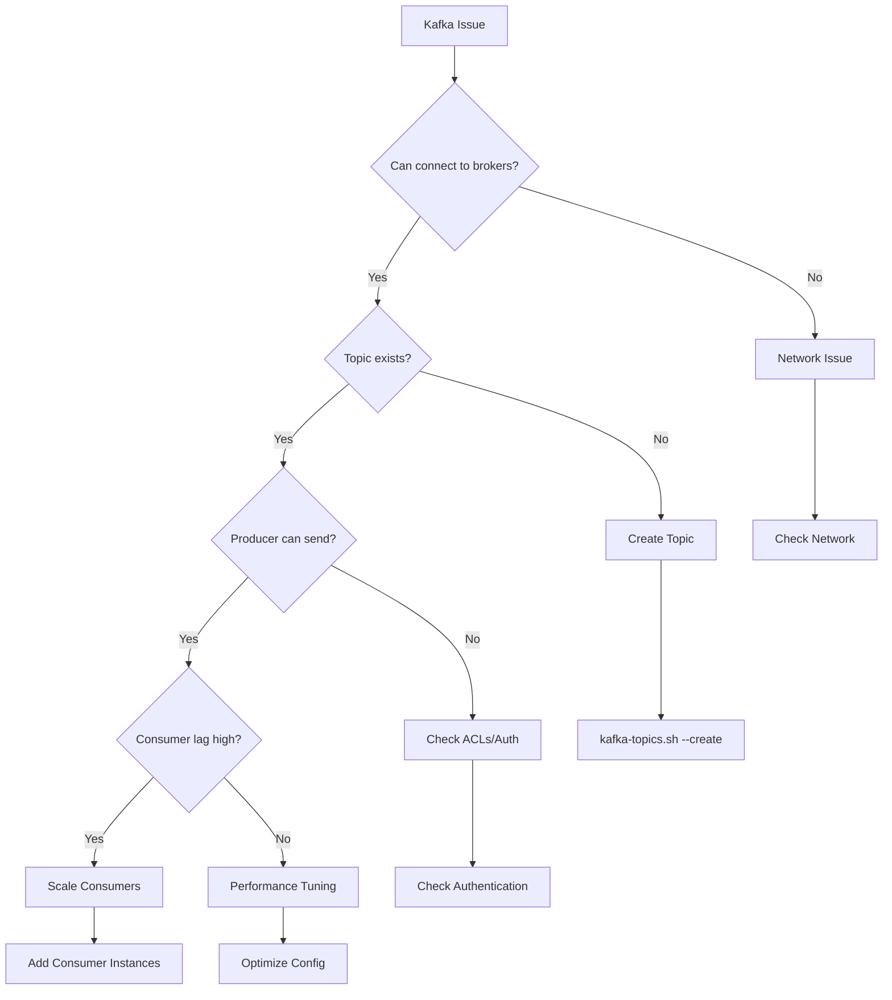
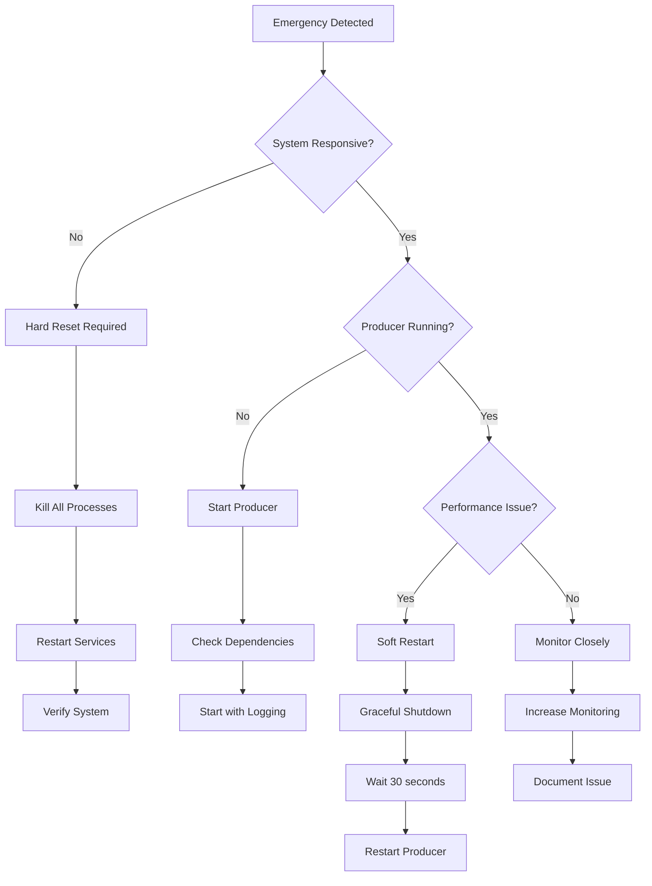

# Kafka Video Producer - Troubleshooting Guide

### Complete CLI Commands Table

| Category                    | Command                                                                                     | Description                                      | Usage Example                                                                                  |
|----------------------------|----------------------------------------------------------------------------------------------|--------------------------------------------------|-------------------------------------------------------------------------------------------------|
| **APPLICATION CONTROL**     | `python 22-Fps-Producer.py`                                                                 | Start the video frame producer                   | `python 22-Fps-Producer.py`                                                                     |
| **APPLICATION CONTROL**     | `Ctrl+C`                                                                                    | Graceful shutdown of the producer                | Press `Ctrl+C` during execution                                                                 |
| **APPLICATION CONTROL**     | `nohup python 22-Fps-Producer.py &`                                                        | Run producer in background                       | `nohup python 22-Fps-Producer.py > producer.log 2>&1 &`                                         |
| **APPLICATION CONTROL**     | `ps aux | grep 22-Fps-Producer`                                                            | Find running producer processes                  | `ps aux | grep python`                                                                          |
| **APPLICATION CONTROL**     | `kill -SIGINT <PID>`                                                                       | Send graceful shutdown signal                    | `kill -SIGINT 12345`                                                                            |
| **APPLICATION CONTROL**     | `kill -9 <PID>`                                                                            | Force kill producer process                      | `kill -9 12345`                                                                                 |
| **KAFKA CLUSTER MANAGEMENT**| `kafka-topics.sh --list --bootstrap-server`                                               | List all available Kafka topics                  | `kafka-topics.sh --list --bootstrap-server 10.1.56.46:9092`                                    |
| **KAFKA CLUSTER MANAGEMENT**| `kafka-topics.sh --create --topic`                                                        | Create new Kafka topic                           | `kafka-topics.sh --create --topic AgriCam3 --bootstrap-server 10.1.56.46:9092 --partitions 3 --replication-factor 3` |
| **KAFKA CLUSTER MANAGEMENT**| `kafka-topics.sh --delete --topic`                                                        | Delete Kafka topic                               | `kafka-topics.sh --delete --topic AgriCam3 --bootstrap-server 10.1.56.46:9092`                  |
| **KAFKA CLUSTER MANAGEMENT**| `kafka-topics.sh --describe --topic`                                                      | Get topic details and configuration              | `kafka-topics.sh --describe --topic AgriCam3 --bootstrap-server 10.1.56.46:9092`                |
| **KAFKA CLUSTER MANAGEMENT**| `kafka-broker-api-versions.sh`                                                            | Check broker API versions                        | `kafka-broker-api-versions.sh --bootstrap-server 10.1.56.46:9092`                              |
| **KAFKA CLUSTER MANAGEMENT**| `kafka-log-dirs.sh`                                                                        | Check log directories and sizes                  | `kafka-log-dirs.sh --bootstrap-server 10.1.56.46:9092 --describe`                              |
| **MONITORING & DIAGNOSTICS**| `kafka-console-consumer.sh --topic`                                                       | Real-time message consumption monitoring         | `kafka-console-consumer.sh --topic AgriCam3 --bootstrap-server 10.1.56.46:9092`                |
| **MONITORING & DIAGNOSTICS**| `kafka-console-consumer.sh --from-beginning`                                              | Read all messages from topic start               | `kafka-console-consumer.sh --topic AgriCam3 --bootstrap-server 10.1.56.46:9092 --from-beginning` |
| **MONITORING & DIAGNOSTICS**| `kafka-consumer-groups.sh --list`                                                         | List all consumer groups                         | `kafka-consumer-groups.sh --list --bootstrap-server 10.1.56.46:9092`                           |
| **MONITORING & DIAGNOSTICS**| `kafka-consumer-groups.sh --describe`                                                     | Check consumer group lag and offsets             | `kafka-consumer-groups.sh --describe --group my-group --bootstrap-server 10.1.56.46:9092`      |
| **MONITORING & DIAGNOSTICS**| `kafka-run-class.sh kafka.tools.GetOffsetShell`                                           | Check topic offset information                   | `kafka-run-class.sh kafka.tools.GetOffsetShell --broker-list 10.1.56.46:9092 --topic AgriCam3` |
| **MONITORING & DIAGNOSTICS**| `tail -f producer.log`                                                                     | Monitor real-time application logs               | `tail -f producer.log`                                                                          |
| **MONITORING & DIAGNOSTICS**| `grep "ERROR|CRITICAL" producer.log`                                                      | Filter error messages from logs                  | `grep "ERROR|CRITICAL" producer.log`                                                            |
| **NETWORK CONNECTIVITY**    | `ping 10.1.56.46`                                                                          | Test basic network connectivity                  | `ping -c 4 10.1.56.46`                                                                          |
| **NETWORK CONNECTIVITY**    | `telnet 10.1.56.46 9092`                                                                   | Test Kafka broker connectivity                   | `telnet 10.1.56.46 9092`                                                                        |
| **NETWORK CONNECTIVITY**    | `netstat -an | grep 9092`                                                                  | Check port status and connections                | `netstat -an | grep 9092`                                                                       |
| **NETWORK CONNECTIVITY**    | `curl -I http://10.1.56.46:9085`                                                           | Test video stream HTTP endpoint                  | `curl -I http://10.1.56.46:9085`                                                                |
| **NETWORK CONNECTIVITY**    | `wget --spider http://10.1.56.46:9085`                                                     | Check video stream availability                  | `wget --spider http://10.1.56.46:9085`                                                          |
| **NETWORK CONNECTIVITY**    | `nmap -p 9092-9094 10.1.56.46`                                                             | Scan Kafka cluster ports                         | `nmap -p 9092-9094 10.1.56.46`                                                                  |
| **SYSTEM RESOURCES**        | `top | grep python`                                                                        | Monitor CPU and memory usage                     | `top -p $(pgrep -f 22-Fps-Producer)`                                                            |
| **SYSTEM RESOURCES**        | `htop -p <PID>`                                                                            | Advanced process monitoring                      | `htop -p 12345`                                                                                 |
| **SYSTEM RESOURCES**        | `iostat -x 1`                                                                              | Monitor disk I/O statistics                      | `iostat -x 1 10`                                                                                |
| **SYSTEM RESOURCES**        | `sar -n DEV 1`                                                                             | Monitor network interface statistics             | `sar -n DEV 1 10`                                                                               |
| **SYSTEM RESOURCES**        | `df -h`                                                                                    | Check disk space usage                           | `df -h /var/log`                                                                                |
| **SYSTEM RESOURCES**        | `free -h`                                                                                  | Check memory usage                               | `free -h`                                                                                       |
| **DEBUGGING & TROUBLESHOOTING** | `strace -p <PID>`                                                                   | Trace system calls for debugging                 | `strace -p 12345`                                                                               |
| **DEBUGGING & TROUBLESHOOTING** | `lsof -i :9092`                                                                    | List processes using Kafka port                  | `lsof -i :9092-9094`                                                                            |
| **DEBUGGING & TROUBLESHOOTING** | `tcpdump -i any port 9092`                                                          | Capture network traffic to Kafka                 | `tcpdump -i any port 9092 -w kafka_traffic.pcap`                                                |
| **DEBUGGING & TROUBLESHOOTING** | `journalctl -f -u kafka`                                                            | Monitor Kafka service logs (systemd)             | `journalctl -f -u kafka`                                                                        |
| **DEBUGGING & TROUBLESHOOTING** | `python -c "import cv2; print(cv2.__version__)"`                                  | Check OpenCV version                             | `python -c "import cv2; print(cv2.__version__)"`                                                |
| **DEBUGGING & TROUBLESHOOTING** | `python -c "from kafka import KafkaProducer"`                                      | Test Kafka Python library                        | `python -c "from kafka import KafkaProducer; print('OK')"`                                      |
| **PERFORMANCE TESTING**     | `kafka-producer-perf-test.sh`                                                              | Test Kafka producer performance                  | `kafka-producer-perf-test.sh --topic AgriCam3 --num-records 1000 --record-size 100000 --throughput 100 --producer-props bootstrap.servers=10.1.56.46:9092` |
| **PERFORMANCE TESTING**     | `kafka-consumer-perf-test.sh`                                                              | Test Kafka consumer performance                  | `kafka-consumer-perf-test.sh --topic AgriCam3 --bootstrap-server 10.1.56.46:9092 --messages 1000` |
| **PERFORMANCE TESTING**     | `ab -n 100 -c 10 http://10.1.56.46:9085`                                                   | Benchmark video stream endpoint                  | `ab -n 100 -c 10 http://10.1.56.46:9085`                                                         |
| **CONFIGURATION & SETUP**   | `pip install opencv-python kafka-python termcolor`                                        | Install required Python packages                 | `pip install -r requirements.txt`                                                               |
| **CONFIGURATION & SETUP**   | `pip list | grep -E "(opencv|kafka|termcolor)"`                                           | Verify installed packages                        | `pip list | grep opencv`                                                                         |
| **CONFIGURATION & SETUP**   | `python --version`                                                                         | Check Python version                             | `python --version`                                                                              |
| **CONFIGURATION & SETUP**   | `which python`                                                                             | Find Python executable path                      | `which python`                                                                                  |
| **LOG MANAGEMENT**          | `logrotate /etc/logrotate.d/producer`                                                     | Rotate application logs                          | `logrotate -f /etc/logrotate.d/producer`                                                        |
| **LOG MANAGEMENT**          | `find /var/log -name "*.log" -size +100M`                                                  | Find large log files                             | `find . -name "producer*.log" -size +100M`                                                      |
| **LOG MANAGEMENT**          | `gzip producer.log.old`                                                                    | Compress old log files                           | `gzip *.log.old`                                                                                |
| **LOG MANAGEMENT**          | `du -sh /var/log/`                                                                          | Check log directory size                         | `du -sh logs/`                                                                                  |

## Quick Diagnostic Commands

### Immediate Health Check Script
```bash
#!/bin/bash
echo "=== Kafka Video Producer Health Check ==="
echo "1. Testing Video Stream..."
curl -I http://10.1.56.46:9085 2>/dev/null && echo "✓ Video stream accessible" || echo "✗ Video stream failed"

echo "2. Testing Kafka Brokers..."
for port in 9092 9093 9094; do
    timeout 3 telnet 10.1.56.46 $port 2>/dev/null && echo "✓ Kafka broker :$port accessible" || echo "✗ Kafka broker :$port failed"
done

echo "3. Checking Topic Existence..."
kafka-topics.sh --list --bootstrap-server 10.1.56.46:9092 2>/dev/null | grep -q "AgriCam3" && echo "✓ Topic AgriCam3 exists" || echo "✗ Topic AgriCam3 missing"

echo "4. Checking Python Dependencies..."
python -c "import cv2, kafka, termcolor; print('✓ All dependencies available')" 2>/dev/null || echo "✗ Missing dependencies"

echo "5. Checking System Resources..."
free -m | awk 'NR==2{printf "Memory: %s/%sMB (%.2f%%)\n", $3,$2,$3*100/$2 }'
df -h | awk '$NF=="/"{printf "Disk: %d/%dGB (%s)\n", $3,$2,$5}'
```

---

## Common Issues and Solutions

### Issue Classification Matrix

| Issue Category | Symptoms | Root Cause | Solution Priority |
|---------------|----------|------------|------------------|
| **Connection Failures** | "Could not open video source" | Network/Stream issues | HIGH |
| **Kafka Unavailable** | "Error creating Kafka producer" | Broker connectivity | HIGH |
| **Performance Degradation** | Low FPS, High latency | Resource constraints | MEDIUM |
| **Memory Issues** | System slowdown, OOM errors | Memory leaks/usage | HIGH |
| **Process Crashes** | Unexpected exits | Unhandled exceptions | HIGH |

### Detailed Problem Resolution

#### 1. Video Stream Connection Issues

**Symptoms:**
- `Error: Could not open video source: http://10.1.56.46:9085`
- `Warning: Failed to capture frame`
- Black frames or corrupted video

**Diagnostic Commands:**
```bash
# Test HTTP endpoint
curl -I http://10.1.56.46:9085
wget --spider http://10.1.56.46:9085

# Check network connectivity
ping -c 4 10.1.56.46
traceroute 10.1.56.46

# Test with alternative tools
ffprobe http://10.1.56.46:9085
vlc http://10.1.56.46:9085  # GUI test
```

**Solutions:**
```bash
# Solution 1: Restart video service
sudo systemctl restart video-stream-service

# Solution 2: Check firewall rules
sudo iptables -L | grep 9085
sudo ufw status | grep 9085

# Solution 3: Test with different OpenCV backends
python -c "
import cv2
cap = cv2.VideoCapture('http://10.1.56.46:9085', cv2.CAP_FFMPEG)
print('FFMPEG Backend:', cap.isOpened())
cap.release()
"
```

#### 2. Kafka Producer Connection Issues

**Symptoms:**
- `Error creating Kafka producer`
- `Failed to create Kafka producer after 5 retries`
- Connection timeouts

**Diagnostic Commands:**
```bash
# Test individual broker connections
for port in 9092 9093 9094; do
    echo "Testing broker :$port"
    timeout 5 telnet 10.1.56.46 $port
    echo "Exit code: $?"
done

# Check broker status
kafka-broker-api-versions.sh --bootstrap-server 10.1.56.46:9092

# Verify topic accessibility
kafka-topics.sh --list --bootstrap-server 10.1.56.46:9092
```

**Solutions:**
```bash
# Solution 1: Restart Kafka services
sudo systemctl restart kafka
sudo systemctl status kafka

# Solution 2: Check Kafka logs
sudo journalctl -u kafka -f
tail -f /var/log/kafka/server.log

# Solution 3: Verify network connectivity
nmap -p 9092-9094 10.1.56.46
netstat -tulpn | grep :909[2-4]

# Solution 4: Test with kafka-console-producer
kafka-console-producer.sh --topic AgriCam3 --bootstrap-server 10.1.56.46:9092
```

#### 3. Performance and FPS Issues

**Symptoms:**
- Actual FPS significantly lower than target (30 FPS)
- High CPU usage
- Delayed frame processing

**Diagnostic Commands:**
```bash
# Monitor system resources
top -p $(pgrep -f 22-Fps-Producer)
htop -p $(pgrep -f 22-Fps-Producer)

# Check I/O statistics
iostat -x 1 10
sar -u 1 10

# Monitor network bandwidth
iftop -i eth0
nethogs
```

**Solutions:**
```bash
# Solution 1: Optimize frame quality
# Modify code to reduce JPEG quality
python -c "
import cv2
# In your code, change:
# _, buffer = cv2.imencode('.jpg', frame)
# To:
# _, buffer = cv2.imencode('.jpg', frame, [cv2.IMWRITE_JPEG_QUALITY, 70])
"

# Solution 2: Increase system resources
# Check available resources
free -h
nproc  # Number of CPU cores

# Solution 3: Reduce logging frequency
# Modify logging frequency in code from every 100 frames to 500
```

#### 4. Memory Management Issues

**Symptoms:**
- Gradually increasing memory usage
- Out of Memory (OOM) errors
- System becomes unresponsive

**Diagnostic Commands:**
```bash
# Monitor memory usage over time
while true; do
    ps -p $(pgrep -f 22-Fps-Producer) -o pid,ppid,cmd,%mem,rss
    sleep 5
done

# Check for memory leaks
valgrind --tool=memcheck --leak-check=full python 22-Fps-Producer.py

# Monitor system memory
watch -n 1 'free -h && echo "--- Process Memory ---" && ps aux --sort=-%mem | head -10'
```

**Solutions:**
```bash
# Solution 1: Implement garbage collection
python -c "
import gc
# Add to your main loop:
# if frame_count % 1000 == 0:
#     gc.collect()
"

# Solution 2: Limit buffer retention
# Ensure buffers are properly released after Kafka send

# Solution 3: Restart producer periodically
# Add cron job for periodic restarts
echo "0 */6 * * * /usr/bin/pkill -f 22-Fps-Producer && sleep 10 && /usr/bin/python /path/to/22-Fps-Producer.py" | crontab -
```

---

## System Health Monitoring

### Real-time Monitoring Dashboard

```bash
#!/bin/bash
# monitoring_dashboard.sh
while true; do
    clear
    echo "=== Kafka Video Producer Dashboard ==="
    echo "Time: $(date)"
    echo ""
    
    # Process Status
    if pgrep -f 22-Fps-Producer > /dev/null; then
        PID=$(pgrep -f 22-Fps-Producer)
        echo "✓ Producer Status: RUNNING (PID: $PID)"
        ps -p $PID -o pid,ppid,cmd,%cpu,%mem,etime
    else
        echo "✗ Producer Status: NOT RUNNING"
    fi
    
    echo ""
    
    # System Resources
    echo "=== System Resources ==="
    free -h | grep -E "(Mem|Swap)"
    echo "CPU Load: $(uptime | awk -F'load average:' '{print $2}')"
    echo "Disk Usage: $(df -h / | tail -1 | awk '{print $5 " used"}')"
    
    echo ""
    
    # Network Status
    echo "=== Network Status ==="
    echo "Video Stream: $(curl -s -o /dev/null -w "%{http_code}" http://10.1.56.46:9085)"
    echo "Kafka Brokers:"
    for port in 9092 9093 9094; do
        timeout 2 bash -c "</dev/tcp/10.1.56.46/$port" 2>/dev/null && echo "  :$port ✓" || echo "  :$port ✗"
    done
    
    echo ""
    echo "Press Ctrl+C to exit"
    sleep 5
done
```

### Log Analysis Tools

```bash
# Real-time error monitoring
tail -f producer.log | grep --color=always -E "(ERROR|CRITICAL|WARNING)"

# Performance metrics extraction
grep "Actual FPS" producer.log | tail -20

# Frame size analysis
grep "Frame Size" producer.log | awk '{print $NF}' | sort -n | tail -10

# Error frequency analysis
grep -c "ERROR" producer.log && grep -c "WARNING" producer.log
```

---

## Performance Troubleshooting

### Performance Benchmarking Commands

| Test Type | Command | Expected Result | Troubleshooting |
|-----------|---------|-----------------|-----------------|
| **Video Stream Latency** | `time curl -s http://10.1.56.46:9085 > /dev/null` | < 1 second | Check network bandwidth |
| **Kafka Producer Throughput** | `kafka-producer-perf-test.sh --topic AgriCam3 --num-records 1000 --record-size 100000 --throughput 100 --producer-props bootstrap.servers=10.1.56.46:9092` | > 80 MB/sec | Optimize Kafka config |
| **Frame Processing Speed** | `python -c "import cv2; import time; cap=cv2.VideoCapture('http://10.1.56.46:9085'); start=time.time(); [cap.read() for _ in range(30)]; print(f'30 frames in {time.time()-start:.2f}s')"` | < 1 second | Reduce frame quality |
| **Memory Usage Growth** | `while true; do ps -p $(pgrep -f 22-Fps-Producer) -o rss --no-headers; sleep 10; done` | Stable RSS | Fix memory leaks |

### Performance Optimization Commands

```bash
# CPU affinity optimization
taskset -cp 0,1 $(pgrep -f 22-Fps-Producer)

# I/O priority adjustment
ionice -c 1 -n 4 -p $(pgrep -f 22-Fps-Producer)

# Network buffer tuning
sudo sysctl -w net.core.rmem_max=134217728
sudo sysctl -w net.core.wmem_max=134217728

# Kafka JVM tuning (if applicable)
export KAFKA_HEAP_OPTS="-Xmx2G -Xms2G"
```

---

## Network Connectivity Issues

### Network Diagnostic Matrix

| Component | Test Command | Success Indicator | Failure Action |
|-----------|--------------|-------------------|----------------|
| **Basic Connectivity** | `ping -c 4 10.1.56.46` | 0% packet loss | Check routing/firewall |
| **Video Stream Port** | `telnet 10.1.56.46 9085` | Connection established | Restart video service |
| **Kafka Broker 1** | `telnet 10.1.56.46 9092` | Connection established | Check Kafka service |
| **Kafka Broker 2** | `telnet 10.1.56.46 9093` | Connection established | Check cluster health |
| **Kafka Broker 3** | `telnet 10.1.56.46 9094` | Connection established | Verify configuration |
| **DNS Resolution** | `nslookup 10.1.56.46` | Valid response | Check DNS settings |
| **Route Tracing** | `traceroute 10.1.56.46` | Complete path | Identify network hops |

### Network Troubleshooting Commands

```bash
# Comprehensive network analysis
echo "=== Network Connectivity Analysis ==="

# 1. Basic connectivity
ping -c 3 10.1.56.46

# 2. Port scanning
nmap -p 9085,9092-9094 10.1.56.46

# 3. Route analysis
traceroute 10.1.56.46

# 4. Bandwidth testing
iperf3 -c 10.1.56.46 -p 5201  # Requires iperf3 server on target

# 5. Firewall status
sudo iptables -L -n | grep 10.1.56.46
sudo ufw status numbered

# 6. Network interface statistics
ip -s link show
netstat -i

# 7. Active connections
netstat -an | grep 10.1.56.46
ss -tuln | grep -E ":909[2-5]"
```

---

## Kafka-Specific Problems

### Kafka Troubleshooting Decision Tree



### Kafka Diagnostic Commands

```bash
# Complete Kafka health check
echo "=== Kafka Cluster Health Check ==="

# 1. Broker connectivity
kafka-broker-api-versions.sh --bootstrap-server 10.1.56.46:9092

# 2. Topic information
kafka-topics.sh --describe --topic AgriCam3 --bootstrap-server 10.1.56.46:9092

# 3. Consumer group status
kafka-consumer-groups.sh --list --bootstrap-server 10.1.56.46:9092
kafka-consumer-groups.sh --describe --all-groups --bootstrap-server 10.1.56.46:9092

# 4. Log directory analysis
kafka-log-dirs.sh --bootstrap-server 10.1.56.46:9092 --describe

# 5. Topic partition details
kafka-run-class.sh kafka.tools.GetOffsetShell --broker-list 10.1.56.46:9092 --topic AgriCam3

# 6. Configuration dump
kafka-configs.sh --bootstrap-server 10.1.56.46:9092 --entity-type topics --entity-name AgriCam3 --describe

# 7. Performance testing
kafka-producer-perf-test.sh --topic AgriCam3 --num-records 1000 --record-size 100000 --throughput 100 --producer-props bootstrap.servers=10.1.56.46:9092
```

### Kafka Recovery Procedures

```bash
# Emergency Kafka recovery
echo "=== Kafka Emergency Recovery ==="

# 1. Restart Kafka services
sudo systemctl stop kafka
sudo systemctl start zookeeper  # If using ZooKeeper
sleep 10
sudo systemctl start kafka

# 2. Recreate problematic topics
kafka-topics.sh --delete --topic AgriCam3 --bootstrap-server 10.1.56.46:9092
kafka-topics.sh --create --topic AgriCam3 --bootstrap-server 10.1.56.46:9092 --partitions 3 --replication-factor 3

# 3. Reset consumer offsets (if needed)
kafka-consumer-groups.sh --bootstrap-server 10.1.56.46:9092 --group video-consumers --reset-offsets --to-earliest --topic AgriCam3 --execute

# 4. Verify cluster integrity
kafka-topics.sh --list --bootstrap-server 10.1.56.46:9092
```

---

## Video Stream Issues

### Video Stream Diagnostic Protocol

| Issue Type | Diagnostic Command | Expected Output | Resolution |
|------------|-------------------|-----------------|------------|
| **HTTP Accessibility** | `curl -I http://10.1.56.46:9085` | `HTTP/1.1 200 OK` | Restart video service |
| **Stream Format** | `ffprobe http://10.1.56.46:9085` | Video codec info | Check encoding |
| **Frame Rate** | `ffplay http://10.1.56.46:9085` | Smooth playback | Adjust stream quality |
| **Bandwidth Usage** | `iftop -i eth0` | Reasonable traffic | Optimize compression |
| **OpenCV Compatibility** | `python -c "import cv2; cap=cv2.VideoCapture('http://10.1.56.46:9085'); print(cap.isOpened())"` | `True` | Update OpenCV |

### Video Stream Recovery Commands

```bash
# Video stream troubleshooting toolkit
echo "=== Video Stream Analysis ==="

# 1. HTTP response analysis
curl -v http://10.1.56.46:9085 2>&1 | head -20

# 2. Stream metadata
ffprobe -v quiet -print_format json -show_format -show_streams http://10.1.56.46:9085

# 3. OpenCV backend testing
python3 << EOF
import cv2
backends = [
    (cv2.CAP_FFMPEG, "FFMPEG"),
    (cv2.CAP_GSTREAMER, "GStreamer"),
    (cv2.CAP_V4L2, "V4L2")
]
for backend, name in backends:
    cap = cv2.VideoCapture("http://10.1.56.46:9085", backend)
    print(f"{name}: {cap.isOpened()}")
    cap.release()
EOF

# 4. Network throughput to stream
wget --progress=dot --spider http://10.1.56.46:9085 2>&1 | grep -E "(Length|speed)"

# 5. Alternative streaming test
vlc --intf dummy --play-and-exit http://10.1.56.46:9085 2>&1 | grep -E "(error|main)"
```

---

## Resource Management

### System Resource Monitoring Matrix

| Resource Type | Monitoring Command | Critical Threshold | Action Required |
|---------------|-------------------|------------------|-----------------|
| **CPU Usage** | `top -p $(pgrep -f 22-Fps-Producer)` | > 80% | Optimize processing |
| **Memory Usage** | `ps -p $(pgrep -f 22-Fps-Producer) -o %mem` | > 70% | Check memory leaks |
| **Disk I/O** | `iostat -x 1` | > 80% utilization | Optimize I/O |
| **Network** | `sar -n DEV 1` | > 80% bandwidth | Reduce frame quality |
| **File Descriptors** | `lsof -p $(pgrep -f 22-Fps-Producer) | wc -l` | > 1000 | Check resource cleanup |

### Resource Optimization Commands

```bash
# System resource optimization
echo "=== Resource Optimization ==="

# 1. CPU optimization
# Set CPU affinity to specific cores
taskset -cp 0-3 $(pgrep -f 22-Fps-Producer)

# 2. Memory optimization
# Enable memory compression
echo 1 | sudo tee /proc/sys/vm/compact_memory

# 3. I/O optimization
# Set I/O scheduler to deadline for better real-time performance
echo deadline | sudo tee /sys/block/sda/queue/scheduler

# 4. Network optimization
# Increase network buffer sizes
sudo sysctl -w net.core.rmem_default=262144
sudo sysctl -w net.core.wmem_default=262144

# 5. Process priority
# Increase process priority
sudo nice -n -10 python 22-Fps-Producer.py

# 6. File descriptor limits
# Check and increase limits
ulimit -n 4096
```

---

## Advanced Debugging

### System-Level Debugging Tools

```bash
# Advanced debugging toolkit
echo "=== Advanced Debugging ==="

# 1. System call tracing
strace -p $(pgrep -f 22-Fps-Producer) -e trace=network,file -o producer_syscalls.log

# 2. Library call tracing
ltrace -p $(pgrep -f 22-Fps-Producer) -o producer_ltrace.log

# 3. Performance profiling
perf record -p $(pgrep -f 22-Fps-Producer) sleep 30
perf report

# 4. Memory analysis
valgrind --tool=massif python 22-Fps-Producer.py

# 5. Network packet capture
tcpdump -i any -w producer_traffic.pcap host 10.1.56.46

# 6. Python debugging
python -m pdb 22-Fps-Producer.py

# 7. GDB debugging
gdb python $(pgrep -f 22-Fps-Producer)
```

### Code-Level Debugging

```python
# Debug-enabled version of key functions
import logging
import time
import traceback

# Enhanced logging configuration
logging.basicConfig(
    level=logging.DEBUG,
    format='%(asctime)s %(levelname)s [%(funcName)s:%(lineno)d] %(message)s',
    handlers=[
        logging.FileHandler('producer_debug.log'),
        logging.StreamHandler()
    ]
)

def debug_send_video_frames(producer, topic, video_source, fps=30):
    """Enhanced debug version with detailed logging"""
    logging.debug(f"Starting video capture from {video_source}")
    
    cap = cv2.VideoCapture(video_source)
    if not cap.isOpened():
        logging.error(f"Failed to open video source: {video_source}")
        # Additional debug info
        logging.debug(f"OpenCV version: {cv2.__version__}")
        logging.debug(f"Available backends: {cv2.getBuildInformation()}")
        return
    
    # Get video properties
    width = cap.get(cv2.CAP_PROP_FRAME_WIDTH)
    height = cap.get(cv2.CAP_PROP_FRAME_HEIGHT)
    source_fps = cap.get(cv2.CAP_PROP_FPS)
    
    logging.debug(f"Video properties: {width}x{height} @ {source_fps} FPS")
    
    frame_times = []
    encode_times = []
    send_times = []
    
    try:
        while True:
            frame_start = time.time()
            
            ret, frame = cap.read()
            if not ret:
                logging.warning("Failed to capture frame")
                logging.debug(f"Capture return: {ret}, Frame shape: {frame.shape if frame is not None else 'None'}")
                break
            
            # Encoding timing
            encode_start = time.time()
            _, buffer = cv2.imencode('.jpg', frame)
            encode_time = time.time() - encode_start
            encode_times.append(encode_time)
            
            # Kafka send timing
            send_start = time.time()
            try:
                producer.send(topic, buffer.tobytes())
                send_time = time.time() - send_start
                send_times.append(send_time)
            except Exception as e:
                logging.error(f"Kafka send failed: {e}")
                logging.debug(f"Exception traceback: {traceback.format_exc()}")
            
            frame_time = time.time() - frame_start
            frame_times.append(frame_time)
            
            # Periodic performance reporting
            if len(frame_times) % 100 == 0:
                avg_frame_time = sum(frame_times[-100:]) / 100
                avg_encode_time = sum(encode_times[-100:]) / 100
                avg_send_time = sum(send_times[-100:]) / 100
                
                logging.debug(f"Performance metrics (last 100 frames):")
                logging.debug(f"  Average frame time: {avg_frame_time:.4f}s")
                logging.debug(f"  Average encode time: {avg_encode_time:.4f}s")
                logging.debug(f"  Average send time: {avg_send_time:.4f}s")
                logging.debug(f"  Effective FPS: {1/avg_frame_time:.2f}")
            
            # FPS control
            sleep_time = (1.0 / fps) - frame_time
            if sleep_time > 0:
                time.sleep(sleep_time)
            else:
                logging.warning(f"Cannot maintain {fps} FPS, frame took {frame_time:.4f}s")
                
    except Exception as e:
        logging.critical(f"Critical error in video processing: {e}")
        logging.debug(f"Exception traceback: {traceback.format_exc()}")
    finally:
        cap.release()
        logging.debug("Video capture released")
```

---

## Emergency Procedures

### Emergency Response Protocol



### Emergency Command Scripts

```bash
#!/bin/bash
# emergency_procedures.sh

case "$1" in
    "status")
        echo "=== Emergency Status Check ==="
        echo "Producer Status: $(pgrep -f 22-Fps-Producer >/dev/null && echo 'RUNNING' || echo 'STOPPED')"
        echo "System Load: $(uptime | awk -F'load average:' '{print $2}')"
        echo "Memory Usage: $(free | awk '/^Mem:/{printf "%.1f%%", $3/$2 * 100.0}')"
        echo "Disk Usage: $(df / | tail -1 | awk '{print $5}')"
        ;;
        
    "force-restart")
        echo "=== Emergency Force Restart ==="
        pkill -9 -f 22-Fps-Producer
        sleep 5
        nohup python 22-Fps-Producer.py > producer_emergency.log 2>&1 &
        echo "Producer restarted with PID: $(pgrep -f 22-Fps-Producer)"
        ;;
        
    "graceful-restart")
        echo "=== Emergency Graceful Restart ==="
        PID=$(pgrep -f 22-Fps-Producer)
        if [ ! -z "$PID" ]; then
            kill -SIGINT $PID
            echo "Sent SIGINT to PID $PID, waiting for graceful shutdown..."
            sleep 30
            if pgrep -f 22-Fps-Producer >/dev/null; then
                echo "Graceful shutdown failed, forcing..."
                pkill -9 -f 22-Fps-Producer
            fi
        fi
        sleep 5
        nohup python 22-Fps-Producer.py > producer_emergency.log 2>&1 &
        echo "Producer restarted with PID: $(pgrep -f 22-Fps-Producer)"
        ;;
        
    "system-reset")
        echo "=== Emergency System Reset ==="
        # Stop producer
        pkill -9 -f 22-Fps-Producer
        
        # Restart services
        sudo systemctl restart kafka
        sleep 10
        
        # Clear problematic topics
        kafka-topics.sh --delete --topic AgriCam3 --bootstrap-server 10.1.56.46:9092 2>/dev/null
        sleep 5
        kafka-topics.sh --create --topic AgriCam3 --bootstrap-server 10.1.56.46:9092 --partitions 3 --replication-factor 3
        
        # Restart producer
        nohup python 22-Fps-Producer.py > producer_emergency.log 2>&1 &
        echo "System reset completed"
        ;;
        
    "health-report")
        echo "=== Emergency Health Report ==="
        echo "Timestamp: $(date)"
        echo "System Uptime: $(uptime)"
        echo "Producer Status: $(pgrep -f 22-Fps-Producer >/dev/null && echo 'RUNNING' || echo 'STOPPED')"
        echo "Video Stream: $(curl -s -o /dev/null -w "%{http_code}" http://10.1.56.46:9085)"
        echo "Kafka Brokers:"
        for port in 9092 9093 9094; do
            timeout 2 bash -c "</dev/tcp/10.1.56.46/$port" 2>/dev/null && echo "  :$port ✓" || echo "  :$port ✗"
        done
        echo "Recent Errors:"
        tail -10 producer.log 2>/dev/null | grep -E "(ERROR|CRITICAL)" || echo "  No recent errors"
        ;;
        
    *)
        echo "Usage: $0 {status|force-restart|graceful-restart|system-reset|health-report}"
        exit 1
        ;;
esac
```

### Emergency Contact Information

| Emergency Type | Response Time | Contact Method | Escalation |
|----------------|---------------|----------------|------------|
| **System Down** | < 5 minutes | Direct intervention | Team lead notification |
| **Performance Degraded** | < 15 minutes | Monitoring alerts | Log analysis required |
| **Data Loss Risk** | < 2 minutes | Immediate shutdown | Backup verification |
| **Security Incident** | < 1 minute | Isolate system | Security team notification |

### Recovery Verification Checklist

```bash
# Post-emergency verification
echo "=== Recovery Verification Checklist ==="

# 1. Producer running
pgrep -f 22-Fps-Producer >/dev/null && echo "✓ Producer running" || echo "✗ Producer not"


