# Kafka Broker Operations Guide

## Architecture Overview

```mermaid
graph TB
    subgraph "Edge Device Real-Time Data Pipeline - Broker Layer"
        subgraph "ZooKeeper Coordination Layer"
            ZK[ZooKeeper Server<br/>📍 localhost:2181<br/>🔧 Admin: localhost:9090<br/>📂 Data: /config/data<br/>⚙️ Manages cluster metadata<br/>⚙️ Leader election<br/>⚙️ Configuration management]
        end
        
        subgraph "Kafka Broker Cluster - Multi-Instance Setup"
            B0["🟢 Broker 0 (Primary)<br/>🆔 broker.id=0<br/>📍 169.254.3.1:9092<br/>📂 /config/broker-logs-0<br/>🔄 3 Network Threads<br/>💾 8 I/O Threads<br/>📊 Default 3 Partitions"]
            B1["🔵 Broker 1 (Secondary)<br/>🆔 broker.id=1<br/>📍 169.254.3.1:9093<br/>📂 /config/logs-1<br/>🔄 3 Network Threads<br/>💾 8 I/O Threads<br/>📊 Default 3 Partitions"]
            B2["🟠 Broker 2 (Tertiary)<br/>🆔 broker.id=2<br/>📍 169.254.3.1:9094<br/>📂 /config/logs-2<br/>🔄 3 Network Threads<br/>💾 8 I/O Threads<br/>📊 Default 3 Partitions"]
        end
        
        subgraph "Data Flow & Communication"
            direction TB
            PROD["📤 Producers<br/>Send data to brokers<br/>Load balancing across partitions"]
            CONS["📥 Consumers<br/>Read data from brokers<br/>Consumer groups for scalability"]
            ADMIN["⚙️ Admin Tools<br/>Topic management<br/>Cluster monitoring<br/>Configuration changes"]
        end
        
        subgraph "Storage Layer"
            DS0["💾 Broker 0 Storage<br/>Log segments (1GB each)<br/>7-day retention<br/>Partition replicas"]
            DS1["💾 Broker 1 Storage<br/>Log segments (1GB each)<br/>7-day retention<br/>Partition replicas"]
            DS2["💾 Broker 2 Storage<br/>Log segments (1GB each)<br/>7-day retention<br/>Partition replicas"]
        end
        
        subgraph "Network Protocols & Security"
            NET["🌐 Network Layer<br/>PLAINTEXT protocol<br/>TCP connections<br/>⚠️ No encryption<br/>⚠️ No authentication"]
        end
    end
    
    %% Connections
    ZK -.-> B0
    ZK -.-> B1
    ZK -.-> B2
    
    B0 --> DS0
    B1 --> DS1
    B2 --> DS2
    
    PROD --> B0
    PROD --> B1
    PROD --> B2
    
    B0 --> CONS
    B1 --> CONS
    B2 --> CONS
    
    ADMIN --> ZK
    ADMIN --> B0
    ADMIN --> B1
    ADMIN --> B2
    
    B0 -.-> NET
    B1 -.-> NET
    B2 -.-> NET
    
    %% Styling
    style ZK fill:#e1f5fe,stroke:#01579b,stroke-width:2px
    style B0 fill:#e8f5e8,stroke:#2e7d32,stroke-width:2px
    style B1 fill:#e3f2fd,stroke:#1565c0,stroke-width:2px
    style B2 fill:#fff3e0,stroke:#ef6c00,stroke-width:2px
    style NET fill:#ffebee,stroke:#c62828,stroke-width:2px
```



---

## Quick Start for Beginners

### 📋 Prerequisites Checklist
- ✅ Java 8+ installed
- ✅ Kafka 2.13-3.8.0 installed
- ✅ Network ports 2181, 9090, 9092-9094 available
- ✅ Sufficient disk space (minimum 10GB)

---

## 1. 🧭 Navigation Commands

### Understanding Your Location
```bash
# Show current directory
pwd
# Expected output: /path/to/broker

# List all configuration files
ls -la
# Shows: zookeeper.properties, server-0.properties, server-1.properties, server-2.properties

# View directory structure
tree .
# Alternative if tree not available:
find . -type f | sort
```

### Moving Around the Project
```bash
# Go to parent directory (main project)
cd ..

# Return to broker directory
cd broker

# Go to other components
cd ../consumer    # Consumer component
cd ../producer    # Producer component (if exists)
```

---

## 2. 📄 Configuration File Management

### Viewing Configuration Files
```bash
# Quick view of ZooKeeper config
cat zookeeper.properties

# View specific broker configuration
cat server-0.properties
cat server-1.properties
cat server-2.properties

# Search for specific settings
grep "broker.id" server-*.properties
# Output shows broker IDs: 0, 1, 2

grep "listeners" server-*.properties
# Output shows ports: 9092, 9093, 9094
```

### Checking Configuration Syntax
```bash
# Validate ZooKeeper config (if kafka tools available)
kafka-configs.sh --zookeeper localhost:2181 --describe --entity-type brokers

# Check if ports are available before starting
netstat -an | grep -E ":(2181|9090|9092|9093|9094)"
# Should show no output if ports are free
```

---

## 3. 🚀 System Startup Commands

### Step 1: Start ZooKeeper (Always First!)
```bash
# Start ZooKeeper in background
kafka-server-start.sh zookeeper.properties > zookeeper.log 2>&1 &

# Or start in foreground (for debugging)
kafka-server-start.sh zookeeper.properties
```

### Step 2: Start Kafka Brokers (After ZooKeeper)
```bash
# Start Broker 0 (Primary)
kafka-server-start.sh server-0.properties > broker-0.log 2>&1 &

# Start Broker 1 (Secondary)
kafka-server-start.sh server-1.properties > broker-1.log 2>&1 &

# Start Broker 2 (Tertiary)
kafka-server-start.sh server-2.properties > broker-2.log 2>&1 &
```

### Alternative: Start All in Separate Terminals
```bash
# Terminal 1: ZooKeeper
kafka-server-start.sh zookeeper.properties

# Terminal 2: Broker 0
kafka-server-start.sh server-0.properties

# Terminal 3: Broker 1
kafka-server-start.sh server-1.properties

# Terminal 4: Broker 2
kafka-server-start.sh server-2.properties
```

---

## 4. ✅ Health Check Commands

### ZooKeeper Health Checks
```bash
# Basic ZooKeeper health check
echo ruok | nc localhost 2181
# Expected response: "imok"

# Detailed ZooKeeper status
echo stat | nc localhost 2181
# Shows connections, latency, and mode

# Check ZooKeeper admin interface (if enabled)
curl http://localhost:9090/commands
# Should return JSON with available commands
```

### Kafka Broker Health Checks
```bash
# Check if brokers are responding
kafka-broker-api-versions.sh --bootstrap-server 169.254.3.1:9092
kafka-broker-api-versions.sh --bootstrap-server 169.254.3.1:9093
kafka-broker-api-versions.sh --bootstrap-server 169.254.3.1:9094

# List all brokers in cluster
kafka-metadata.sh --bootstrap-server 169.254.3.1:9092 --describe --brokers

# Quick connectivity test
telnet 169.254.3.1 9092
telnet 169.254.3.1 9093
telnet 169.254.3.1 9094
# Type Ctrl+] then 'quit' to exit
```

---

## 5. 📊 System Status & Information

### Cluster Information
```bash
# Show cluster metadata
kafka-metadata.sh --bootstrap-server 169.254.3.1:9092 --describe

# List all topics
kafka-topics.sh --bootstrap-server 169.254.3.1:9092 --list

# Describe cluster configuration
kafka-configs.sh --bootstrap-server 169.254.3.1:9092 --describe --entity-type brokers
```

### Topic Management
```bash
# Create a test topic
kafka-topics.sh --create --topic test-topic \
  --bootstrap-server 169.254.3.1:9092 \
  --partitions 3 \
  --replication-factor 1

# Describe topic details
kafka-topics.sh --describe --topic test-topic \
  --bootstrap-server 169.254.3.1:9092

# List consumer groups
kafka-consumer-groups.sh --bootstrap-server 169.254.3.1:9092 --list
```

### Performance Monitoring
```bash
# Check broker performance metrics
kafka-run-class.sh kafka.tools.JmxTool \
  --object-name kafka.server:type=BrokerTopicMetrics,name=MessagesInPerSec \
  --jmx-url service:jmx:rmi:///jndi/rmi://localhost:9999/jmxrmi

# Monitor log size
du -sh /home/user/Desktop/kafka_2.13-3.8.0/config/broker-logs-0
du -sh /home/user/Desktop/kafka_2.13-3.8.0/config/logs-1
du -sh /home/user/Desktop/kafka_2.13-3.8.0/config/logs-2
```

---

## 6. 📋 Log Management & Monitoring

### Viewing Real-time Logs
```bash
# Follow ZooKeeper logs
tail -f zookeeper.log

# Follow broker logs
tail -f broker-0.log
tail -f broker-1.log
tail -f broker-2.log

# View last 100 lines of logs
tail -100 broker-0.log
```

### Log Analysis
```bash
# Search for errors in logs
grep -i error *.log
grep -i exception *.log
grep -i "failed" *.log

# Check startup messages
grep -i "started" *.log
grep -i "listening" *.log

# Monitor connection issues
grep -i "connection" *.log
grep -i "timeout" *.log
```

### Log Cleanup
```bash
# Archive old logs (before cleanup)
mkdir -p logs/archive/$(date +%Y%m%d)
mv *.log logs/archive/$(date +%Y%m%d)/

# Clear current logs (when system is stopped)
> zookeeper.log
> broker-0.log
> broker-1.log
> broker-2.log
```

---

## 7. 🔧 Troubleshooting Guide

### Common Issues & Solutions

#### Issue: "Port already in use"
```bash
# Find what's using the port
lsof -i :2181
lsof -i :9092
lsof -i :9093
lsof -i :9094

# Kill process using port (replace PID)
kill -9 <PID>

# Alternative: Kill all Kafka processes
pkill -f kafka
pkill -f zookeeper
```

#### Issue: "ZooKeeper connection failed"
```bash
# Check if ZooKeeper is running
ps aux | grep zookeeper

# Test ZooKeeper connectivity
echo ruok | nc localhost 2181

# Check ZooKeeper logs for errors
grep -i error zookeeper.log
```

#### Issue: "Broker not responding"
```bash
# Check broker process
ps aux | grep "server-0.properties"
ps aux | grep "server-1.properties"
ps aux | grep "server-2.properties"

# Test broker connectivity
telnet 169.254.3.1 9092
telnet 169.254.3.1 9093
telnet 169.254.3.1 9094

# Check broker logs
grep -i "started" broker-*.log
grep -i "error" broker-*.log
```

#### Issue: "Insufficient disk space"
```bash
# Check disk usage
df -h

# Check log directory sizes
du -sh /home/user/Desktop/kafka_2.13-3.8.0/config/broker-logs-0
du -sh /home/user/Desktop/kafka_2.13-3.8.0/config/logs-1
du -sh /home/user/Desktop/kafka_2.13-3.8.0/config/logs-2

# Clean old log segments (if retention allows)
kafka-log-dirs.sh --bootstrap-server 169.254.3.1:9092 --describe
```

---

## 8. 🛑 System Shutdown Commands

### Graceful Shutdown (Recommended)
```bash
# Stop brokers first (reverse order)
kafka-server-stop.sh
# Or kill specific broker processes
ps aux | grep "server-2.properties" | awk '{print $2}' | xargs kill
ps aux | grep "server-1.properties" | awk '{print $2}' | xargs kill
ps aux | grep "server-0.properties" | awk '{print $2}' | xargs kill

# Stop ZooKeeper last
kafka-server-stop.sh
# Or kill ZooKeeper process
ps aux | grep zookeeper | awk '{print $2}' | xargs kill
```

### Force Shutdown (Emergency)
```bash
# Kill all Kafka processes
pkill -9 -f kafka
pkill -9 -f zookeeper

# Verify all processes stopped
ps aux | grep -E "(kafka|zookeeper)"
# Should show no results
```

---

## 9. 🔬 Testing & Validation

### Basic Functionality Tests
```bash
# Test 1: Create test topic
kafka-topics.sh --create --topic health-check \
  --bootstrap-server 169.254.3.1:9092 \
  --partitions 3 --replication-factor 1

# Test 2: Produce test message
echo "Hello Kafka $(date)" | kafka-console-producer.sh \
  --bootstrap-server 169.254.3.1:9092 --topic health-check

# Test 3: Consume test message
kafka-console-consumer.sh --bootstrap-server 169.254.3.1:9092 \
  --topic health-check --from-beginning --max-messages 1

# Test 4: Clean up test topic
kafka-topics.sh --delete --topic health-check \
  --bootstrap-server 169.254.3.1:9092
```

### Performance Testing
```bash
# Produce performance test
kafka-producer-perf-test.sh --topic test-perf \
  --num-records 10000 --record-size 1024 \
  --throughput 1000 --producer-props \
  bootstrap.servers=169.254.3.1:9092

# Consumer performance test
kafka-consumer-perf-test.sh --bootstrap-server 169.254.3.1:9092 \
  --topic test-perf --messages 10000
```

---

## 10. 📚 Quick Reference

### Key File Locations
| File | Purpose | Location |
|------|---------|----------|
| `zookeeper.properties` | ZooKeeper config | Current directory |
| `server-0.properties` | Broker 0 config | Current directory |
| `server-1.properties` | Broker 1 config | Current directory |
| `server-2.properties` | Broker 2 config | Current directory |
| ZooKeeper data | Cluster metadata | `/config/data` |
| Broker 0 logs | Message storage | `/config/broker-logs-0` |
| Broker 1 logs | Message storage | `/config/logs-1` |
| Broker 2 logs | Message storage | `/config/logs-2` |

### Essential Ports
| Service | Port | Purpose |
|---------|------|--------|
| ZooKeeper | 2181 | Client connections |
| ZooKeeper Admin | 9090 | Web interface |
| Kafka Broker 0 | 9092 | Producer/Consumer |
| Kafka Broker 1 | 9093 | Producer/Consumer |
| Kafka Broker 2 | 9094 | Producer/Consumer |

### Emergency Commands
```bash
# Quick health check
echo ruok | nc localhost 2181 && echo "ZK OK" || echo "ZK FAILED"

# Stop everything immediately
pkill -f kafka; pkill -f zookeeper

# Check if anything is still running
ps aux | grep -E "(kafka|zookeeper)" | grep -v grep

# Free up ports if stuck
lsof -ti:2181,9090,9092,9093,9094 | xargs kill -9
```

---

## ⚠️ Important Notes for Beginners

1. **Always start ZooKeeper first** - Brokers depend on it
2. **Wait between starts** - Give each service 10-15 seconds to fully start
3. **Check logs immediately** - If something fails, logs will tell you why
4. **This is a development setup** - Not suitable for production without security
5. **Backup before changes** - Always backup configs before modifying
6. **Monitor disk space** - Kafka can fill up disk quickly
7. **Use consistent broker order** - Start 0, then 1, then 2 for predictability

---

**Last Updated:** June 4, 2024  
**Kafka Version:** 2.13-3.8.0  
**Guide Level:** Beginner to Intermediate

