# Kafka Broker Configuration Documentation

## Overview

This directory contains the configuration files for a multi-broker Apache Kafka cluster with ZooKeeper coordination. The setup includes one ZooKeeper instance and three Kafka brokers configured for a real-time data pipeline architecture designed for edge devices.

## Table of Contents

1. [File Structure](#file-structure)
2. [Configuration Files Analysis](#configuration-files-analysis)
3. [Architecture Overview](#architecture-overview)
4. [Network Configuration](#network-configuration)
5. [Performance Settings](#performance-settings)
6. [Data Retention Policies](#data-retention-policies)
7. [System Requirements](#system-requirements)
8. [Deployment Instructions](#deployment-instructions)
9. [Monitoring and Maintenance](#monitoring-and-maintenance)

## File Structure

| File Name | Type | Purpose | Size | Last Modified |
|-----------|------|---------|------|---------------|
| `zookeeper.properties` | Configuration | ZooKeeper coordinator service configuration | 558 bytes | May 30, 2024 |
| `server-0.properties` | Configuration | Primary Kafka broker (ID: 0) configuration | 675 bytes | May 30, 2024 |
| `server-1.properties` | Configuration | Secondary Kafka broker (ID: 1) configuration | 665 bytes | May 30, 2024 |
| `server-2.properties` | Configuration | Tertiary Kafka broker (ID: 2) configuration | 666 bytes | May 30, 2024 |

## Configuration Files Analysis

### ZooKeeper Configuration (`zookeeper.properties`)

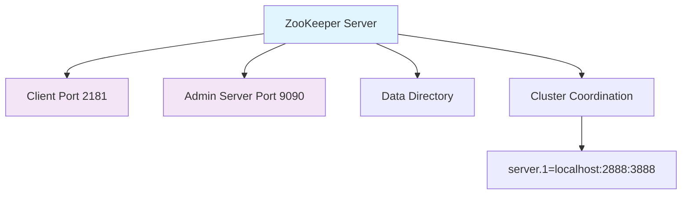

| Parameter | Value | Description |
|-----------|-------|-------------|
| `dataDir` | `/home/user/Desktop/kafka_2.13-3.8.0/config/data` | Directory for ZooKeeper snapshots and transaction logs |
| `clientPort` | `2181` | Port for client connections |
| `maxClientCnxns` | `0` | Unlimited client connections (non-production setting) |
| `admin.enableServer` | `true` | Enable ZooKeeper admin server |
| `admin.serverPort` | `9090` | Admin server web interface port |
| `server.1` | `localhost:2888:3888` | ZooKeeper server configuration (follower:leader ports) |

### Kafka Broker Configurations

#### Common Configuration Parameters

| Parameter | Value | Description | Impact |
|-----------|-------|-------------|--------|
| `num.network.threads` | `3` | Network request handler threads | Controls concurrent network operations |
| `num.io.threads` | `8` | I/O operation threads | Handles disk read/write operations |
| `socket.send.buffer.bytes` | `102400` | Send buffer size (100KB) | Network performance tuning |
| `socket.receive.buffer.bytes` | `102400` | Receive buffer size (100KB) | Network performance tuning |
| `socket.request.max.bytes` | `104857600` | Max request size (100MB) | Large message handling |
| `num.partitions` | `3` | Default partitions per topic | Parallelism and scalability |
| `log.retention.hours` | `168` | Data retention period (7 days) | Storage management |
| `log.segment.bytes` | `1073741824` | Log segment size (1GB) | File system optimization |

#### Broker-Specific Configurations

##### Server 0 (Primary Broker)

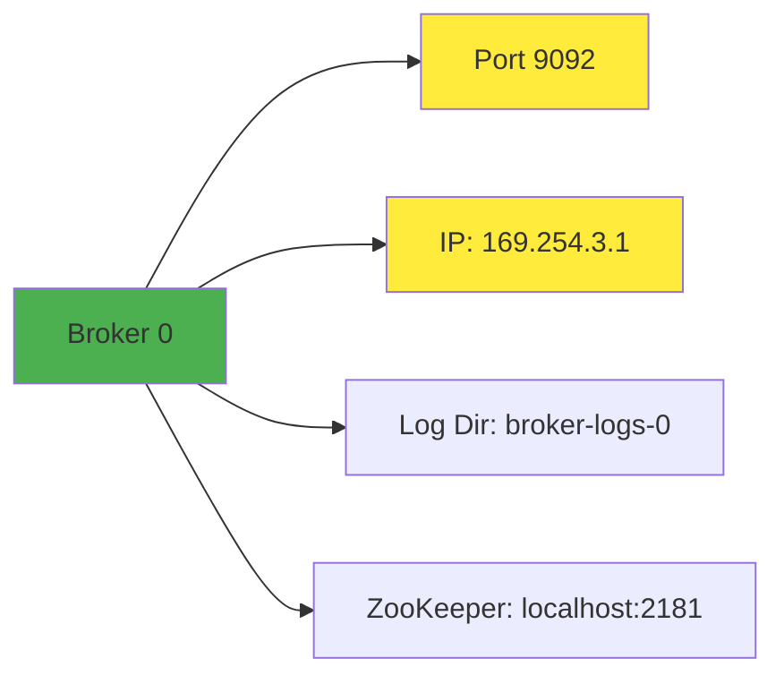

| Parameter | Value | Purpose |
|-----------|-------|--------|
| `broker.id` | `0` | Unique broker identifier |
| `listeners` | `PLAINTEXT://169.254.3.1:9092` | Network interface binding |
| `advertised.listeners` | `PLAINTEXT://169.254.3.1:9092` | Client connection endpoint |
| `log.dirs` | `/home/user/Desktop/kafka_2.13-3.8.0/config/broker-logs-0` | Data storage location |

##### Server 1 (Secondary Broker)

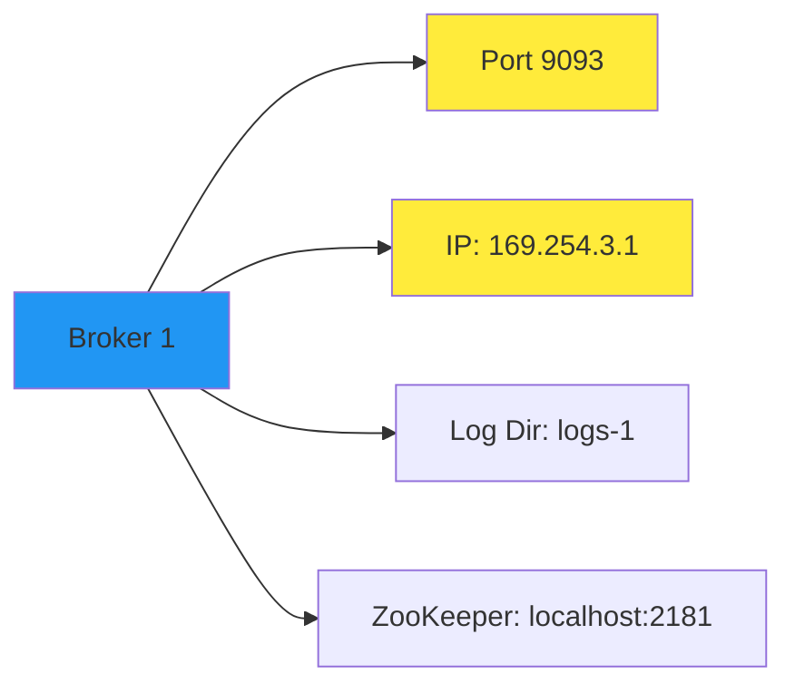

| Parameter | Value | Purpose |
|-----------|-------|--------|
| `broker.id` | `1` | Unique broker identifier |
| `listeners` | `PLAINTEXT://169.254.3.1:9093` | Network interface binding |
| `advertised.listeners` | `PLAINTEXT://169.254.3.1:9093` | Client connection endpoint |
| `log.dirs` | `/home/user/Desktop/kafka_2.13-3.8.0/config/logs-1` | Data storage location |

##### Server 2 (Tertiary Broker)

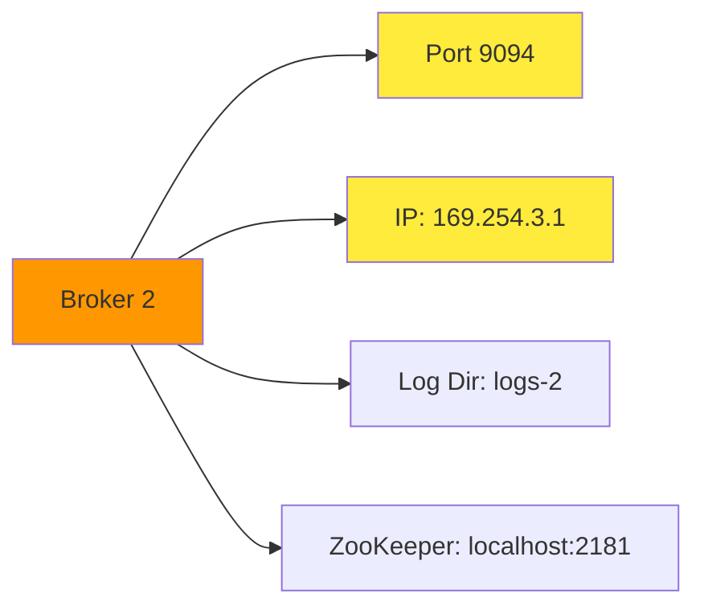

| Parameter | Value | Purpose |
|-----------|-------|--------|
| `broker.id` | `2` | Unique broker identifier |
| `listeners` | `PLAINTEXT://169.254.3.1:9094` | Network interface binding |
| `advertised.listeners` | `PLAINTEXT://169.254.3.1:9094` | Client connection endpoint |
| `log.dirs` | `/home/user/Desktop/kafka_2.13-3.8.0/config/logs-2` | Data storage location |

## Architecture Overview

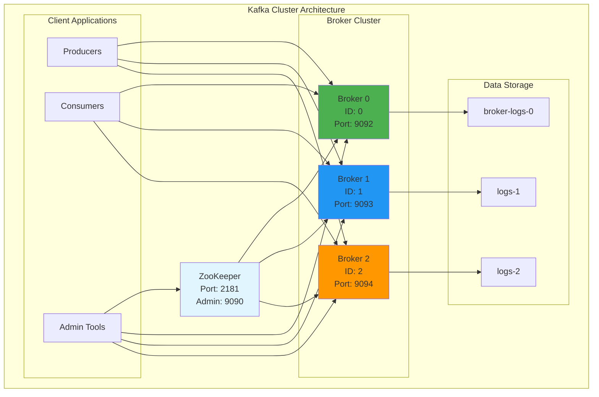

## Network Configuration

### Port Allocation

| Service | Port | Protocol | Purpose |
|---------|------|----------|--------|
| ZooKeeper Client | 2181 | TCP | Client connections |
| ZooKeeper Admin | 9090 | HTTP | Web-based administration |
| ZooKeeper Peer (Follower) | 2888 | TCP | Peer communication |
| ZooKeeper Peer (Leader) | 3888 | TCP | Leader election |
| Kafka Broker 0 | 9092 | TCP | Producer/Consumer connections |
| Kafka Broker 1 | 9093 | TCP | Producer/Consumer connections |
| Kafka Broker 2 | 9094 | TCP | Producer/Consumer connections |

### Network Topology

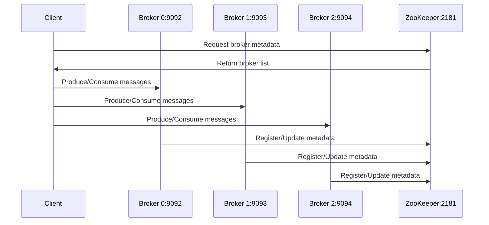

## Performance Settings

### Thread Configuration

| Setting | Value | Impact on Performance |
|---------|-------|----------------------|
| Network Threads | 3 | Handles concurrent client connections |
| I/O Threads | 8 | Processes disk operations in parallel |
| Recovery Threads | 1 per data directory | Speeds up broker startup |

### Buffer Settings

| Buffer Type | Size | Purpose |
|-------------|------|--------|
| Send Buffer | 100 KB | Optimizes network throughput |
| Receive Buffer | 100 KB | Reduces network latency |
| Max Request Size | 100 MB | Supports large message payloads |

### Replication Settings

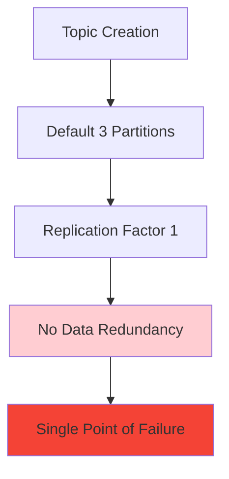

| Parameter | Value | Risk Level | Recommendation |
|-----------|-------|------------|----------------|
| `offsets.topic.replication.factor` | 1 | HIGH | Increase to 3 for production |
| `transaction.state.log.replication.factor` | 1 | HIGH | Increase to 3 for production |
| `transaction.state.log.min.isr` | 1 | HIGH | Increase to 2 for production |

## Data Retention Policies

### Retention Configuration

| Policy | Value | Description |
|--------|-------|-------------|
| Time-based Retention | 168 hours (7 days) | Messages older than 7 days are deleted |
| Size-based Segments | 1 GB | Log files are rolled when they reach 1 GB |
| Retention Check Interval | 300,000 ms (5 minutes) | Frequency of retention policy enforcement |

### Storage Estimation

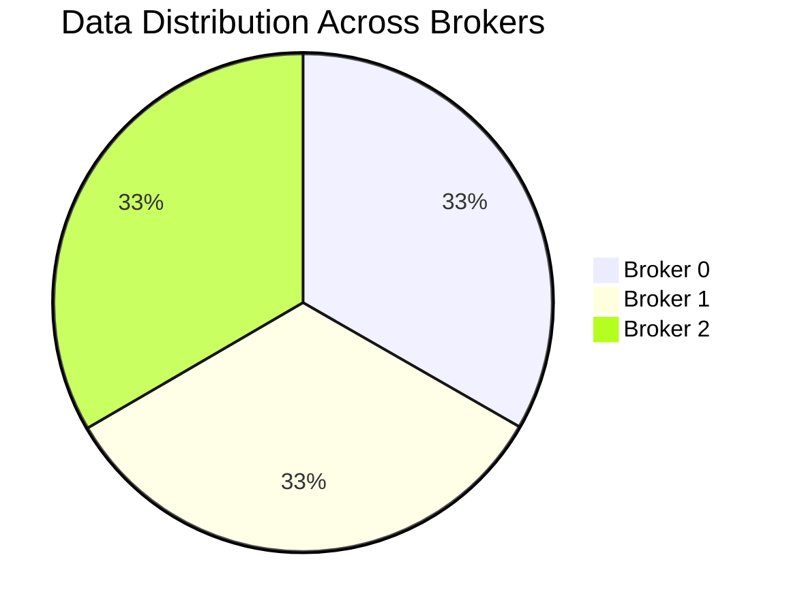

## System Requirements

### Minimum Hardware Requirements

| Component | Requirement | Recommended |
|-----------|-------------|-------------|
| CPU | 2 cores | 4+ cores |
| RAM | 4 GB | 8+ GB |
| Storage | 50 GB | 100+ GB SSD |
| Network | 100 Mbps | 1 Gbps |

### Operating System

| OS | Support Level | Notes |
|----|---------------|-------|
| Linux | Recommended | Best performance |
| macOS | Development | Current setup |
| Windows | Limited | With WSL2 |

## Deployment Instructions

### Prerequisites

1. **Java Runtime Environment**
   ```bash
   java -version
   # Requires Java 8 or higher
   ```

2. **Kafka Installation**
   ```bash
   # Verify Kafka installation
   ls /home/user/Desktop/kafka_2.13-3.8.0/
   ```

### Startup Sequence

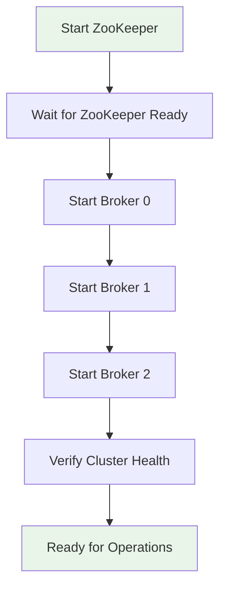

1. **Start ZooKeeper**
   ```bash
   kafka-server-start.sh zookeeper.properties
   ```

2. **Start Kafka Brokers** (in separate terminals)
   ```bash
   kafka-server-start.sh server-0.properties
   kafka-server-start.sh server-1.properties
   kafka-server-start.sh server-2.properties
   ```

### Verification Commands

```bash
# Check ZooKeeper status
echo ruok | nc localhost 2181

# List brokers
kafka-broker-api-versions.sh --bootstrap-server 169.254.3.1:9092

# Create test topic
kafka-topics.sh --create --topic test-topic --bootstrap-server 169.254.3.1:9092 --partitions 3 --replication-factor 1
```

## Monitoring and Maintenance

### Health Check Endpoints

| Service | Endpoint | Check Type |
|---------|----------|------------|
| ZooKeeper | `localhost:2181` | TCP connection |
| ZooKeeper Admin | `http://localhost:9090` | HTTP status |
| Broker 0 | `169.254.3.1:9092` | Kafka protocol |
| Broker 1 | `169.254.3.1:9093` | Kafka protocol |
| Broker 2 | `169.254.3.1:9094` | Kafka protocol |

### Log Locations

| Component | Log Directory | Purpose |
|-----------|---------------|--------|
| ZooKeeper | `/home/user/Desktop/kafka_2.13-3.8.0/config/data` | Coordination data |
| Broker 0 | `/home/user/Desktop/kafka_2.13-3.8.0/config/broker-logs-0` | Message storage |
| Broker 1 | `/home/user/Desktop/kafka_2.13-3.8.0/config/logs-1` | Message storage |
| Broker 2 | `/home/user/Desktop/kafka_2.13-3.8.0/config/logs-2` | Message storage |

### Maintenance Tasks

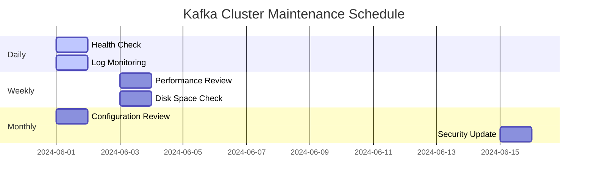

## Security Considerations

⚠️ **Current Security Level: DEVELOPMENT ONLY**

| Risk | Current State | Production Recommendation |
|------|---------------|---------------------------|
| Authentication | None (PLAINTEXT) | Enable SASL/SSL |
| Authorization | None | Configure ACLs |
| Encryption | None | Enable SSL/TLS |
| Network Security | Open connections | Implement firewall rules |

## Troubleshooting Guide

### Common Issues

| Issue | Symptoms | Solution |
|-------|----------|----------|
| ZooKeeper Connection Failed | Brokers can't start | Check ZooKeeper is running on port 2181 |
| Port Already in Use | "Address already in use" error | Check for existing processes, kill if necessary |
| Insufficient Disk Space | Broker crashes during operation | Clean old logs, increase retention policy |
| Network Connectivity | Clients can't connect | Verify firewall settings and IP configuration |

### Performance Optimization

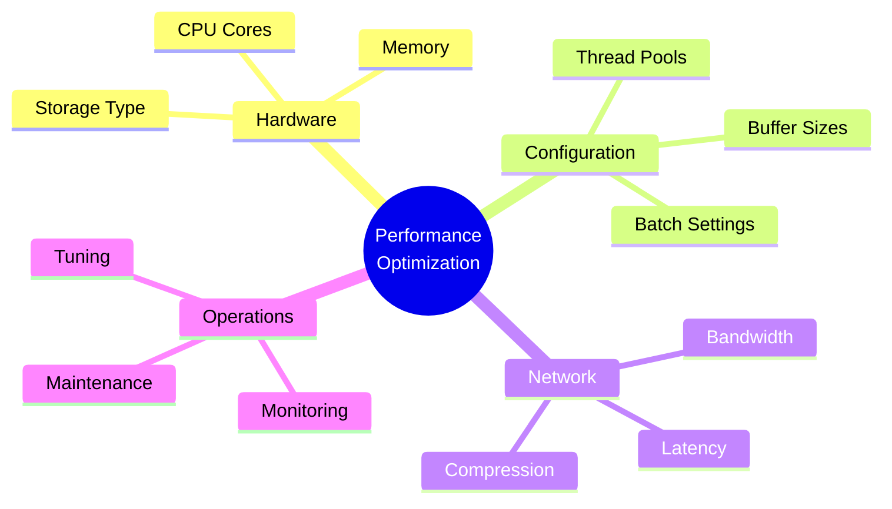

---

## Configuration Summary

This Kafka cluster configuration is designed for **development and testing** environments. For production deployment, consider:

1. **Increase replication factors** to 3 for fault tolerance
2. **Enable security features** (SSL/SASL)
3. **Implement monitoring** (JMX metrics, logging)
4. **Scale hardware resources** based on throughput requirements
5. **Configure proper network security** (firewalls, VPNs)

**Last Updated:** June 4, 2024  
**Configuration Version:** Kafka 2.13-3.8.0  
**Cluster Mode:** Development Multi-Broker Setup

