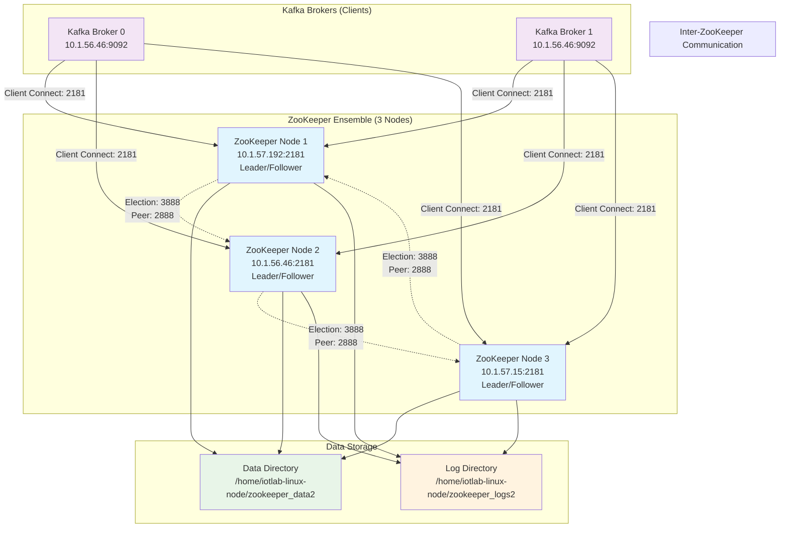
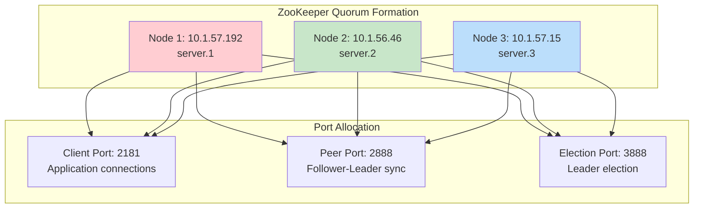
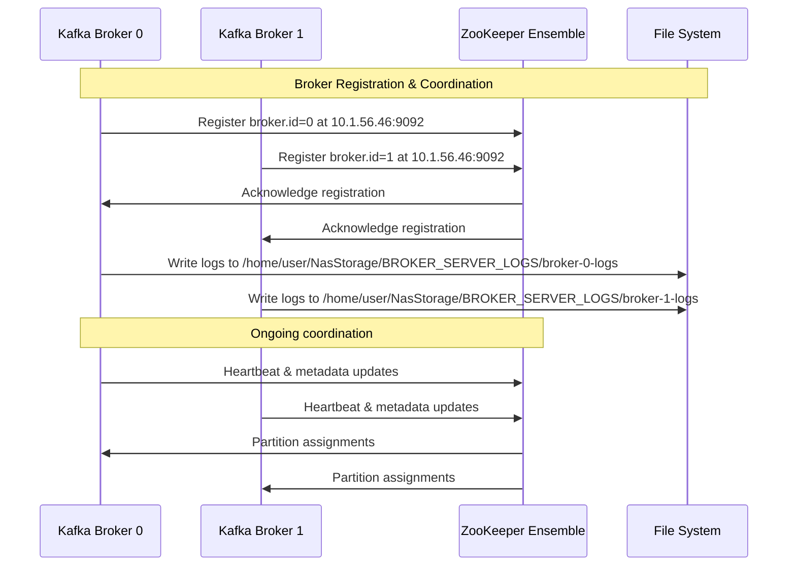
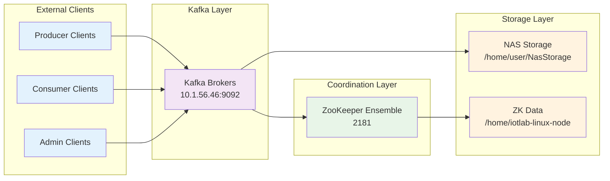
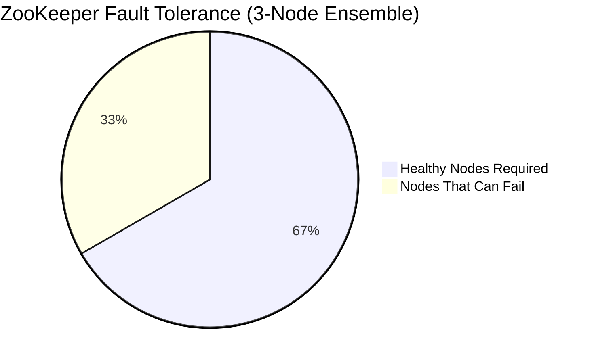
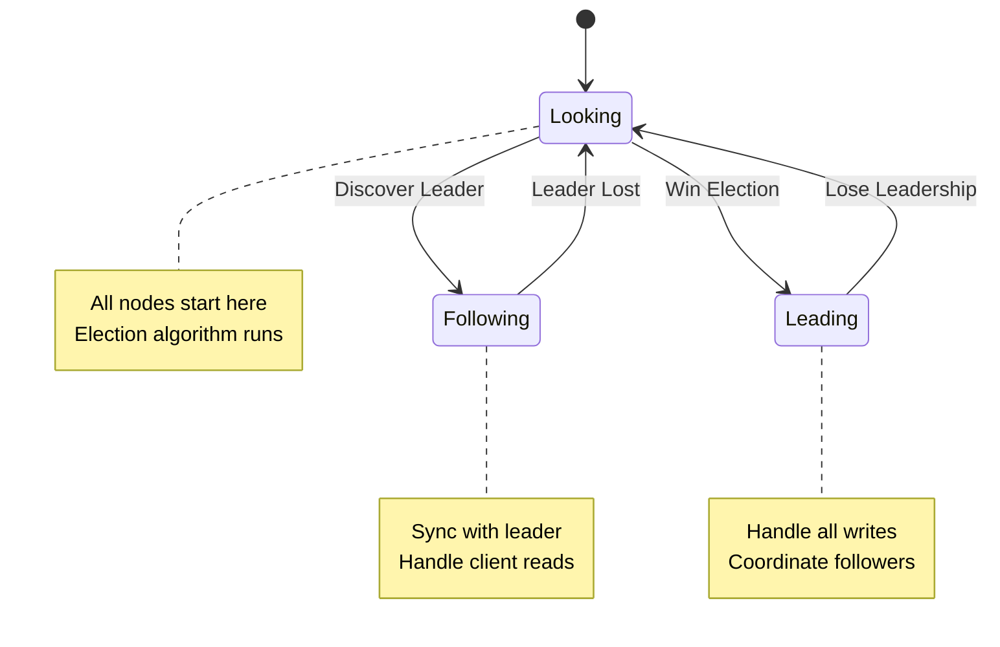
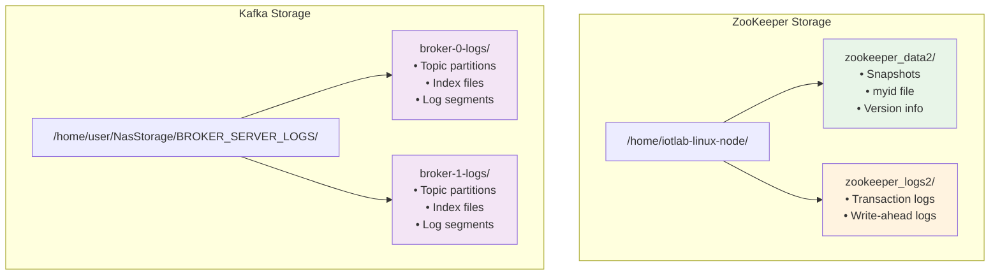
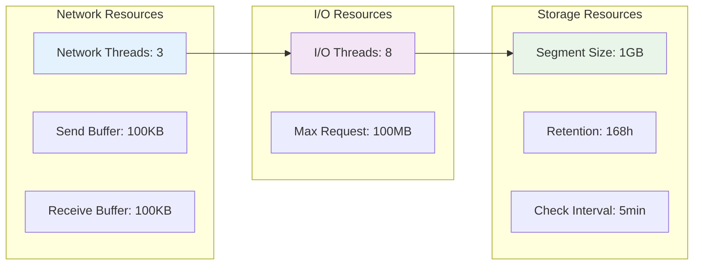

# ZooKeeper Cluster Configuration Documentation

## Overview

This directory contains configuration files for a 3-node ZooKeeper ensemble that provides coordination services for a distributed Kafka cluster. The ZooKeeper cluster ensures high availability, fault tolerance, and distributed consensus for the Kafka brokers.

---

## Architecture Diagram

---

## File Inventory

| File Name | Type | Purpose | Target Machine | Size |
|-----------|------|---------|----------------|------|
| `zookeeper.properties.M1` | ZooKeeper Config | Node 1 configuration | Machine 1 (10.1.57.192) | 1,548 bytes |
| `zookeeper.properties.M2` | ZooKeeper Config | Node 2 configuration | Machine 2 (10.1.56.46) | 1,548 bytes |
| `zookeeper.properties.M3` | ZooKeeper Config | Node 3 configuration | Machine 3 (10.1.57.15) | 1,548 bytes |
| `server.propertiesM1` | Kafka Config | Broker 0 configuration | Machine 1 | 535 bytes |
| `server_1.propertiesM1` | Kafka Config | Broker 1 configuration | Machine 1 | 535 bytes |

---

## ZooKeeper Ensemble Configuration

### Cluster Topology

### ZooKeeper Configuration Parameters

| Parameter | Value | Description | Impact |
|-----------|-------|-------------|--------|
| **dataDir** | `/home/iotlab-linux-node/zookeeper_data2` | Snapshot storage location | Data persistence |
| **dataLogDir** | `/home/iotlab-linux-node/zookeeper_logs2` | Transaction log storage | Performance optimization |
| **tickTime** | `2000` ms | Basic time unit for heartbeats | Session timeout calculation |
| **initLimit** | `5` ticks | Follower connection timeout to leader | Cluster formation time |
| **syncLimit** | `2` ticks | Follower sync timeout with leader | Network tolerance |
| **clientPort** | `2181` | Client connection port | Application connectivity |
| **maxClientCnxns** | `60` | Maximum concurrent client connections | Scalability limit |
| **admin.enableServer** | `false` | Administrative HTTP server status | Security configuration |
| **electionPortBindRetry** | `5` | Election port binding retry attempts | Fault tolerance |

### Server Definitions

| Server ID | IP Address | Peer Port | Election Port | Role |
|-----------|------------|-----------|---------------|------|
| `server.1` | `10.1.57.192` | `2888` | `3888` | Ensemble Member |
| `server.2` | `10.1.56.46` | `2888` | `3888` | Ensemble Member |
| `server.3` | `10.1.57.15` | `2888` | `3888` | Ensemble Member |

---

## Kafka Broker Integration

### Broker Configuration Analysis

### Kafka Broker Parameters

#### Broker Identity & Network
| Parameter | Broker 0 Value | Broker 1 Value | Description |
|-----------|----------------|----------------|-------------|
| **broker.id** | `0` | `1` | Unique broker identifier |
| **listeners** | `PLAINTEXT://10.1.56.46:9092` | `PLAINTEXT://10.1.56.46:9092` | Internal listener configuration |
| **advertised.listeners** | `PLAINTEXT://10.1.56.46:9092` | `PLAINTEXT://10.1.56.46:9092` | External client connection endpoint |

#### Storage Configuration
| Parameter | Broker 0 Value | Broker 1 Value | Description |
|-----------|----------------|----------------|-------------|
| **log.dirs** | `/home/user/NasStorage/BROKER_SERVER_LOGS/broker-0-logs` | `/home/user/NasStorage/BROKER_SERVER_LOGS/broker-1-logs` | Data storage location |

#### ZooKeeper Integration
| Parameter | Value | Description |
|-----------|-------|-------------|
| **zookeeper.connect** | `10.1.57.192:2181,10.1.56.46:2181,10.1.57.15:2181` | ZooKeeper ensemble connection string |
| **zookeeper.connection.timeout.ms** | `18000` | Connection timeout (18 seconds) |

#### Performance Tuning
| Parameter | Value | Description | Performance Impact |
|-----------|-------|-------------|--------------------|
| **num.network.threads** | `3` | Network request handler threads | Network throughput |
| **num.io.threads** | `8` | I/O operation threads | Disk I/O performance |
| **socket.send.buffer.bytes** | `102400` (100KB) | TCP send buffer size | Network efficiency |
| **socket.receive.buffer.bytes** | `102400` (100KB) | TCP receive buffer size | Network efficiency |
| **socket.request.max.bytes** | `104857600` (100MB) | Maximum request size | Message size limit |

#### Data Retention
| Parameter | Value | Description | Storage Impact |
|-----------|-------|-------------|----------------|
| **log.retention.hours** | `168` (7 days) | Data retention period | Storage utilization |
| **log.segment.bytes** | `1073741824` (1GB) | Log segment size | File management |
| **log.retention.check.interval.ms** | `300000` (5 minutes) | Cleanup check frequency | Maintenance overhead |

---

## Network Architecture

### Port Allocation Matrix

| Service | Node 1 (10.1.57.192) | Node 2 (10.1.56.46) | Node 3 (10.1.57.15) | Purpose |
|---------|----------------------|---------------------|---------------------|----------|
| **ZooKeeper Client** | 2181 | 2181 | 2181 | Client connections |
| **ZooKeeper Peer** | 2888 | 2888 | 2888 | Follower-Leader sync |
| **ZooKeeper Election** | 3888 | 3888 | 3888 | Leader election |
| **Kafka Broker** | - | 9092 | - | Message brokering |

### Communication Flow

---

## Configuration Consistency Analysis

### ZooKeeper Configuration Uniformity

| Configuration Aspect | M1 | M2 | M3 | Status |
|-----------------------|----|----|----|--------|
| **dataDir Path** | ✅ Identical | ✅ Identical | ✅ Identical | Consistent |
| **dataLogDir Path** | ✅ Identical | ✅ Identical | ✅ Identical | Consistent |
| **tickTime** | ✅ 2000ms | ✅ 2000ms | ✅ 2000ms | Consistent |
| **initLimit** | ✅ 5 ticks | ✅ 5 ticks | ✅ 5 ticks | Consistent |
| **syncLimit** | ✅ 2 ticks | ✅ 2 ticks | ✅ 2 ticks | Consistent |
| **clientPort** | ✅ 2181 | ✅ 2181 | ✅ 2181 | Consistent |
| **maxClientCnxns** | ✅ 60 | ✅ 60 | ✅ 60 | Consistent |
| **Server Definitions** | ✅ Complete | ✅ Complete | ✅ Complete | Consistent |

### Kafka Broker Configuration Analysis

| Configuration Aspect | server.propertiesM1 | server_1.propertiesM1 | Analysis |
|-----------------------|---------------------|----------------------|----------|
| **broker.id** | 0 | 1 | ✅ Unique IDs |
| **listeners** | Same IP:Port | Same IP:Port | ⚠️ Port conflict potential |
| **advertised.listeners** | Same IP:Port | Same IP:Port | ⚠️ Port conflict potential |
| **log.dirs** | broker-0-logs | broker-1-logs | ✅ Separate directories |
| **zookeeper.connect** | Identical | Identical | ✅ Consistent ensemble |

---

## High Availability & Fault Tolerance

### ZooKeeper Quorum Requirements

| Scenario | Healthy Nodes | Quorum Status | Service Availability |
|----------|---------------|---------------|---------------------|
| All nodes up | 3/3 | ✅ Active | Full service |
| One node down | 2/3 | ✅ Active | Full service |
| Two nodes down | 1/3 | ❌ Lost | Service unavailable |
| All nodes down | 0/3 | ❌ Lost | Complete outage |

### Leader Election Process

---

## Storage Architecture

### Directory Structure

### Storage Capacity Planning

| Component | Storage Type | Location | Estimated Usage | Retention |
|-----------|--------------|----------|----------------|----------|
| **ZK Snapshots** | Data | `/home/iotlab-linux-node/zookeeper_data2` | 10-100MB | Automatic |
| **ZK Logs** | Transaction | `/home/iotlab-linux-node/zookeeper_logs2` | 1-10GB | Configurable |
| **Kafka Logs** | Message Data | `/home/user/NasStorage/BROKER_SERVER_LOGS/` | 100GB+ | 7 days |

---

## Security Configuration

### Current Security Posture

| Security Aspect | Configuration | Risk Level | Recommendation |
|-----------------|---------------|------------|----------------|
| **ZK Admin Server** | Disabled | ✅ Low | Maintain disabled |
| **Client Authentication** | None | ❌ High | Implement SASL |
| **Inter-node Communication** | Plain TCP | ❌ Medium | Enable TLS |
| **Kafka Security** | PLAINTEXT | ❌ High | Enable SSL/SASL |
| **Network Isolation** | None visible | ❌ Medium | Implement VLANs |

---

## Performance Characteristics

### Timing Configuration Analysis

| Parameter | Value | Calculated Timeout | Impact |
|-----------|-------|--------------------|--------|
| **tickTime** | 2000ms | Base unit | Heartbeat interval |
| **initLimit** | 5 ticks | 10 seconds | Follower connection timeout |
| **syncLimit** | 2 ticks | 4 seconds | Follower sync timeout |
| **ZK Connection Timeout** | 18000ms | 18 seconds | Kafka-ZK connection |

### Resource Allocation

---

## Deployment Considerations

### Machine Requirements

| Machine | IP Address | Services | Configuration Files |
|---------|------------|----------|--------------------|
| **Machine 1** | 10.1.57.192 | ZooKeeper Node 1 | `zookeeper.properties.M1` |
| **Machine 2** | 10.1.56.46 | ZooKeeper Node 2, Kafka Brokers | `zookeeper.properties.M2`, `server.propertiesM1`, `server_1.propertiesM1` |
| **Machine 3** | 10.1.57.15 | ZooKeeper Node 3 | `zookeeper.properties.M3` |

### Configuration Deployment Checklist

- [ ] Deploy appropriate ZooKeeper configuration to each machine
- [ ] Create myid files in ZooKeeper data directories (1, 2, 3)
- [ ] Ensure Kafka brokers use different ports if on same machine
- [ ] Verify network connectivity between all nodes
- [ ] Create required directory structures
- [ ] Set appropriate file permissions
- [ ] Configure firewall rules for required ports

---

## Monitoring & Troubleshooting

### Key Metrics to Monitor

| Component | Metric | Normal Range | Alert Threshold |
|-----------|--------|--------------|----------------|
| **ZooKeeper** | Latency | <50ms | >200ms |
| **ZooKeeper** | Outstanding Requests | <10 | >100 |
| **ZooKeeper** | Active Connections | <60 | >55 |
| **Kafka** | Under-replicated Partitions | 0 | >0 |
| **Kafka** | Leader Election Rate | <1/hour | >5/hour |

### Common Issues & Solutions

| Issue | Symptoms | Root Cause | Solution |
|-------|----------|------------|----------|
| **Split Brain** | Multiple leaders | Network partition | Check network connectivity |
| **High Latency** | Slow responses | Disk I/O bottleneck | Monitor disk performance |
| **Connection Timeouts** | Client disconnections | Network issues | Verify ZK connection string |
| **Port Conflicts** | Broker startup failure | Same port configuration | Use different ports per broker |

---

## Configuration Summary

This ZooKeeper cluster configuration provides:

✅ **High Availability**: 3-node ensemble with fault tolerance  
✅ **Performance Optimization**: Separated data and log directories  
✅ **Scalability**: Support for 60 concurrent connections per node  
✅ **Integration Ready**: Proper Kafka broker coordination  

⚠️ **Areas for Improvement**:  
- Enable security features (SASL, TLS)  
- Resolve potential Kafka broker port conflicts  
- Implement monitoring and alerting  
- Add backup and disaster recovery procedures  

---

*This documentation is based on the configuration files present in the cluster_of_zk directory as of the analysis date.*

