# ZooKeeper Cluster Operations Guide

*A beginner's guide to managing and operating the ZooKeeper cluster*

---

## System Overview

```mermaid
graph TD
    subgraph "Your Current Location"
        CWD["📁 cluster_of_zk directory<br/>Configuration files for 3-node ZooKeeper cluster"]
    end
    
    subgraph "Physical Infrastructure"
        M1["🖥️ Machine 1<br/>IP: 10.1.57.192<br/>ZooKeeper Node 1"]
        M2["🖥️ Machine 2<br/>IP: 10.1.56.46<br/>ZooKeeper Node 2 + Kafka Brokers"]
        M3["🖥️ Machine 3<br/>IP: 10.1.57.15<br/>ZooKeeper Node 3"]
    end
    
    subgraph "Configuration Files in This Directory"
        ZK1["📄 zookeeper.properties.M1<br/>→ Deploy to Machine 1"]
        ZK2["📄 zookeeper.properties.M2<br/>→ Deploy to Machine 2"]
        ZK3["📄 zookeeper.properties.M3<br/>→ Deploy to Machine 3"]
        KS1["📄 server.propertiesM1<br/>→ Kafka Broker 0 config"]
        KS2["📄 server_1.propertiesM1<br/>→ Kafka Broker 1 config"]
    end
    
    subgraph "Running Services (After Deployment)"
        ZKS1["⚡ ZooKeeper Service<br/>Port 2181 (client)<br/>Port 2888 (peer)<br/>Port 3888 (election)"]
        ZKS2["⚡ ZooKeeper Service<br/>Port 2181 (client)<br/>Port 2888 (peer)<br/>Port 3888 (election)"]
        ZKS3["⚡ ZooKeeper Service<br/>Port 2181 (client)<br/>Port 2888 (peer)<br/>Port 3888 (election)"]
        KBS1["⚡ Kafka Broker 0<br/>Port 9092"]
        KBS2["⚡ Kafka Broker 1<br/>Port 9092"]
    end
    
    CWD --> ZK1
    CWD --> ZK2
    CWD --> ZK3
    CWD --> KS1
    CWD --> KS2
    
    ZK1 -.-> M1
    ZK2 -.-> M2
    ZK3 -.-> M3
    KS1 -.-> M2
    KS2 -.-> M2
    
    M1 --> ZKS1
    M2 --> ZKS2
    M2 --> KBS1
    M2 --> KBS2
    M3 --> ZKS3
    
    ZKS1 <-.-> ZKS2
    ZKS2 <-.-> ZKS3
    ZKS3 <-.-> ZKS1
    
    KBS1 --> ZKS1
    KBS1 --> ZKS2
    KBS1 --> ZKS3
    KBS2 --> ZKS1
    KBS2 --> ZKS2
    KBS2 --> ZKS3
    
    style CWD fill:#fff2cc
    style M1 fill:#e1f5fe
    style M2 fill:#e8f5e8
    style M3 fill:#f3e5f5
    style ZKS1 fill:#ffcdd2
    style ZKS2 fill:#ffcdd2
    style ZKS3 fill:#ffcdd2
    style KBS1 fill:#d1c4e9
    style KBS2 fill:#d1c4e9
```



---

## Navigation Commands

| Command | Purpose | Example Usage | Expected Output |
|---------|---------|---------------|----------------|
| `pwd` | Show current directory | `pwd` | `/Users/tejpreet/Developer/Documentation/edge_devices_Real_time_Data-pipeline/cluster_of_zk` |
| `ls -la` | List all files with details | `ls -la` | Shows all 5 configuration files |
| `cd ..` | Go to parent directory | `cd ..` | Navigate to main project directory |
| `cd cluster_of_zk` | Enter this directory | `cd cluster_of_zk` | Return to ZooKeeper config directory |

---

## File Examination Commands

### Basic File Viewing
| Command | Purpose | Example Usage | When to Use |
|---------|---------|---------------|-------------|
| `cat zookeeper.properties.M1` | View entire ZK config for Machine 1 | `cat zookeeper.properties.M1` | See complete configuration |
| `head -10 zookeeper.properties.M1` | View first 10 lines | `head -10 zookeeper.properties.M1` | Check file header/license |
| `tail -10 zookeeper.properties.M1` | View last 10 lines | `tail -10 zookeeper.properties.M1` | See server definitions |
| `wc -l zookeeper.properties.M1` | Count lines in file | `wc -l zookeeper.properties.M1` | Check file size (should be ~35 lines) |

### Configuration Analysis
| Command | Purpose | Example Usage | What It Shows |
|---------|---------|---------------|---------------|
| `grep -n "server\." zookeeper.properties.M1` | Find server definitions | `grep -n "server\." zookeeper.properties.M1` | Lines 31-33: server.1, server.2, server.3 |
| `grep -n "dataDir" zookeeper.properties.M1` | Find data directory | `grep -n "dataDir" zookeeper.properties.M1` | Line 16: `/home/iotlab-linux-node/zookeeper_data2` |
| `grep -n "clientPort" zookeeper.properties.M1` | Find client port | `grep -n "clientPort" zookeeper.properties.M1` | Line 22: `clientPort=2181` |
| `grep -n "broker.id" server.propertiesM1` | Find Kafka broker ID | `grep -n "broker.id" server.propertiesM1` | Line 2: `broker.id=0` |

### File Comparison
| Command | Purpose | Example Usage | What to Expect |
|---------|---------|---------------|----------------|
| `diff zookeeper.properties.M1 zookeeper.properties.M2` | Compare ZK configs | `diff zookeeper.properties.M1 zookeeper.properties.M2` | Should show no differences |
| `diff server.propertiesM1 server_1.propertiesM1` | Compare Kafka configs | `diff server.propertiesM1 server_1.propertiesM1` | Different broker.id and log.dirs |

---

## Configuration Extraction Commands

### ZooKeeper Configuration Details
| Command | Purpose | Expected Result |
|---------|---------|----------------|
| `grep -A5 -B2 "List of servers" zookeeper.properties.M1` | Extract server list section | Shows server.1, server.2, server.3 definitions |
| `awk '/server\.[0-9]/ {print NR ": " $0}' zookeeper.properties.M1` | Show numbered server lines | `31: server.1=10.1.57.192:2888:3888` etc. |
| `sed -n '16,22p' zookeeper.properties.M1` | View data directory config | Shows dataDir, dataLogDir, tickTime, etc. |

### Kafka Configuration Details
| Command | Purpose | Expected Result |
|---------|---------|----------------|
| `grep -E "broker\.id\|listeners\|zookeeper\.connect" server.propertiesM1` | Key Kafka settings | broker.id, listeners, zookeeper.connect |
| `grep "log\.dirs" server*.propertiesM1` | Compare log directories | Shows different directories for each broker |

---

## System Information Commands

### Network Connectivity Tests
| Command | Purpose | Example Usage | Success Indicator |
|---------|---------|---------------|-------------------|
| `ping -c 3 10.1.57.192` | Test Machine 1 connectivity | `ping -c 3 10.1.57.192` | `3 packets transmitted, 3 received` |
| `ping -c 3 10.1.56.46` | Test Machine 2 connectivity | `ping -c 3 10.1.56.46` | `3 packets transmitted, 3 received` |
| `ping -c 3 10.1.57.15` | Test Machine 3 connectivity | `ping -c 3 10.1.57.15` | `3 packets transmitted, 3 received` |

### Port Connectivity Tests
| Command | Purpose | Example Usage | Success Indicator |
|---------|---------|---------------|-------------------|
| `nc -zv 10.1.57.192 2181` | Test ZK client port on M1 | `nc -zv 10.1.57.192 2181` | `Connection to 10.1.57.192 port 2181 [tcp/*] succeeded!` |
| `nc -zv 10.1.56.46 2181` | Test ZK client port on M2 | `nc -zv 10.1.56.46 2181` | `Connection to 10.1.56.46 port 2181 [tcp/*] succeeded!` |
| `nc -zv 10.1.57.15 2181` | Test ZK client port on M3 | `nc -zv 10.1.57.15 2181` | `Connection to 10.1.57.15 port 2181 [tcp/*] succeeded!` |
| `nc -zv 10.1.56.46 9092` | Test Kafka broker port | `nc -zv 10.1.56.46 9092` | `Connection to 10.1.56.46 port 9092 [tcp/*] succeeded!` |

---

## Health Check Commands

### ZooKeeper Health
| Command | Purpose | Example Usage | What It Checks |
|---------|---------|---------------|----------------|
| `echo ruok \| nc 10.1.57.192 2181` | ZK health check M1 | `echo ruok \| nc 10.1.57.192 2181` | Should return `imok` if healthy |
| `echo ruok \| nc 10.1.56.46 2181` | ZK health check M2 | `echo ruok \| nc 10.1.56.46 2181` | Should return `imok` if healthy |
| `echo ruok \| nc 10.1.57.15 2181` | ZK health check M3 | `echo ruok \| nc 10.1.57.15 2181` | Should return `imok` if healthy |
| `echo stat \| nc 10.1.56.46 2181` | ZK detailed status | `echo stat \| nc 10.1.56.46 2181` | Shows version, mode (leader/follower), connections |

### Cluster Status
| Command | Purpose | Example Usage | What It Shows |
|---------|---------|---------------|---------------|
| `echo srvr \| nc 10.1.57.192 2181` | Server info M1 | `echo srvr \| nc 10.1.57.192 2181` | Version, latency, node count |
| `echo mntr \| nc 10.1.56.46 2181` | Monitoring stats M2 | `echo mntr \| nc 10.1.56.46 2181` | Detailed metrics (followers, pending syncs, etc.) |
| `echo conf \| nc 10.1.57.15 2181` | Configuration M3 | `echo conf \| nc 10.1.57.15 2181` | Shows current configuration |

---

## Troubleshooting Commands

### Configuration Validation
| Command | Purpose | Example Usage | What to Look For |
|---------|---------|---------------|------------------|
| `grep -c "server\." zookeeper.properties.M*` | Count server definitions | `grep -c "server\." zookeeper.properties.M*` | Should show `3` for each file |
| `grep "clientPort" zookeeper.properties.M*` | Check client ports | `grep "clientPort" zookeeper.properties.M*` | All should be `2181` |
| `grep "broker.id" server*.propertiesM1` | Check broker IDs | `grep "broker.id" server*.propertiesM1` | Should be `0` and `1` |

### Common Issues Detection
| Command | Purpose | Example Usage | Problem Indicator |
|---------|---------|---------------|-------------------|
| `grep -E "listeners.*9092" server*.propertiesM1` | Check port conflicts | `grep -E "listeners.*9092" server*.propertiesM1` | Both files show same port = CONFLICT |
| `grep "zookeeper.connect" server*.propertiesM1` | Verify ZK connection string | `grep "zookeeper.connect" server*.propertiesM1` | Should match actual ZK IPs |

### File Integrity Checks
| Command | Purpose | Example Usage | What It Verifies |
|---------|---------|---------------|------------------|
| `file zookeeper.properties.M*` | Check file types | `file zookeeper.properties.M*` | Should all be `ASCII text` |
| `ls -l zookeeper.properties.M*` | Check file sizes | `ls -l zookeeper.properties.M*` | All should be same size (1548 bytes) |
| `md5 zookeeper.properties.M*` | Check file checksums | `md5 zookeeper.properties.M*` | All should have identical checksums |

---

## Configuration Management Commands

### Backup Operations
| Command | Purpose | Example Usage | When to Use |
|---------|---------|---------------|-------------|
| `cp zookeeper.properties.M1 zookeeper.properties.M1.backup` | Backup single file | `cp zookeeper.properties.M1 zookeeper.properties.M1.backup` | Before making changes |
| `tar -czf zk_configs_backup_$(date +%Y%m%d).tar.gz *.properties*` | Backup all configs | `tar -czf zk_configs_backup_20240604.tar.gz *.properties*` | Before major changes |
| `ls -la *.backup` | List backup files | `ls -la *.backup` | Check existing backups |

### Configuration Verification
| Command | Purpose | Example Usage | Expected Result |
|---------|---------|---------------|----------------|
| `grep -H "dataDir" zookeeper.properties.M*` | Check data directories | `grep -H "dataDir" zookeeper.properties.M*` | All should show same path |
| `grep -H "server.1" zookeeper.properties.M*` | Verify server 1 IP | `grep -H "server.1" zookeeper.properties.M*` | All should show `10.1.57.192:2888:3888` |

---

## Quick Diagnostic Scripts

### Complete Health Check
```bash
# Run this as a single command block
echo "=== ZooKeeper Cluster Health Check ==="
echo "1. Testing network connectivity..."
for ip in 10.1.57.192 10.1.56.46 10.1.57.15; do
  ping -c 1 $ip > /dev/null 2>&1 && echo "✅ $ip - Network OK" || echo "❌ $ip - Network FAILED"
done

echo "\n2. Testing ZooKeeper ports..."
for ip in 10.1.57.192 10.1.56.46 10.1.57.15; do
  nc -zv $ip 2181 2>&1 | grep -q "succeeded" && echo "✅ $ip:2181 - Port OK" || echo "❌ $ip:2181 - Port FAILED"
done

echo "\n3. Testing ZooKeeper health..."
for ip in 10.1.57.192 10.1.56.46 10.1.57.15; do
  result=$(echo ruok | nc $ip 2181 2>/dev/null)
  [[ "$result" == "imok" ]] && echo "✅ $ip - ZK Health OK" || echo "❌ $ip - ZK Health FAILED ($result)"
done
```

### Configuration Consistency Check
```bash
# Check if all ZooKeeper configs are identical
echo "=== Configuration Consistency Check ==="
echo "Checking ZooKeeper configuration files..."
md5_m1=$(md5 -q zookeeper.properties.M1)
md5_m2=$(md5 -q zookeeper.properties.M2)
md5_m3=$(md5 -q zookeeper.properties.M3)

if [[ "$md5_m1" == "$md5_m2" && "$md5_m2" == "$md5_m3" ]]; then
  echo "✅ All ZooKeeper configs are identical"
else
  echo "❌ ZooKeeper configs differ!"
  echo "M1: $md5_m1"
  echo "M2: $md5_m2"
  echo "M3: $md5_m3"
fi

echo "\nChecking Kafka broker configurations..."
broker0_id=$(grep "broker.id" server.propertiesM1 | cut -d'=' -f2)
broker1_id=$(grep "broker.id" server_1.propertiesM1 | cut -d'=' -f2)

if [[ "$broker0_id" != "$broker1_id" ]]; then
  echo "✅ Kafka broker IDs are unique ($broker0_id, $broker1_id)"
else
  echo "❌ Kafka broker IDs conflict! Both are $broker0_id"
fi
```

---

## File Management Commands

### Directory Operations
| Command | Purpose | Example Usage | Result |
|---------|---------|---------------|--------|
| `du -sh .` | Check directory size | `du -sh .` | Shows total size (usually ~10KB) |
| `find . -name "*.properties*" -type f` | Find all property files | `find . -name "*.properties*" -type f` | Lists all 5 configuration files |
| `ls -lt` | List files by modification time | `ls -lt` | Shows newest files first |

### File Search Operations
| Command | Purpose | Example Usage | Use Case |
|---------|---------|---------------|----------|
| `grep -r "10.1.56.46" .` | Find all references to IP | `grep -r "10.1.56.46" .` | Locate all configs using this IP |
| `grep -r "2181" .` | Find all ZooKeeper port refs | `grep -r "2181" .` | See all client port configurations |
| `grep -r "broker" .` | Find all Kafka references | `grep -r "broker" .` | Locate Kafka-related configurations |

---

## Emergency Commands

### Quick Recovery
| Command | Purpose | When to Use | Impact |
|---------|---------|-------------|---------|
| `git checkout -- .` | Restore all files from git | Files corrupted/changed accidentally | Reverts all local changes |
| `cp *.backup .` | Restore from local backups | Need to revert recent changes | Restores backed up files |

### System Reset
```bash
# Emergency cluster restart procedure
echo "=== Emergency ZooKeeper Cluster Restart ==="
echo "1. Stopping all ZooKeeper services..."
# Note: These would be run on respective machines
echo "ssh user@10.1.57.192 'sudo systemctl stop zookeeper'"
echo "ssh user@10.1.56.46 'sudo systemctl stop zookeeper'"
echo "ssh user@10.1.57.15 'sudo systemctl stop zookeeper'"

echo "2. Starting ZooKeeper services..."
echo "ssh user@10.1.57.192 'sudo systemctl start zookeeper'"
echo "ssh user@10.1.56.46 'sudo systemctl start zookeeper'"
echo "ssh user@10.1.57.15 'sudo systemctl start zookeeper'"

echo "3. Verifying cluster health..."
echo "Wait 30 seconds, then run health checks"
```

---

## Understanding the Output

### ZooKeeper Command Responses
| Response | Command | Meaning | Action Needed |
|----------|---------|---------|---------------|
| `imok` | `echo ruok \| nc IP 2181` | ZooKeeper is healthy | None |
| No response | `echo ruok \| nc IP 2181` | ZooKeeper not responding | Check service status |
| `Mode: leader` | `echo stat \| nc IP 2181` | This node is the leader | Normal |
| `Mode: follower` | `echo stat \| nc IP 2181` | This node is a follower | Normal |
| Connection refused | Any nc command | Port not open/service down | Check service and firewall |

### File Content Indicators
| Content | File | Meaning | Normal? |
|---------|------|---------|--------|
| `server.1=10.1.57.192:2888:3888` | ZK properties | Server 1 definition | ✅ Yes |
| `broker.id=0` | server.propertiesM1 | Kafka broker 0 | ✅ Yes |
| `broker.id=1` | server_1.propertiesM1 | Kafka broker 1 | ✅ Yes |
| Same ports in both Kafka configs | Kafka properties | Port conflict | ❌ Problem |

---

## Common Scenarios

### "I need to check if the cluster is healthy"
1. Run: `echo ruok | nc 10.1.57.192 2181`
2. Run: `echo ruok | nc 10.1.56.46 2181`
3. Run: `echo ruok | nc 10.1.57.15 2181`
4. All should return `imok`

### "I want to see the configuration for Machine 2"
1. Run: `cat zookeeper.properties.M2`
2. Look for server definitions at the bottom
3. Check dataDir and clientPort settings

### "I think there's a configuration problem"
1. Run: `diff zookeeper.properties.M1 zookeeper.properties.M2`
2. Run: `diff zookeeper.properties.M2 zookeeper.properties.M3`
3. Run: `grep "broker.id" server*.propertiesM1`
4. Look for differences that shouldn't exist

### "I need to backup everything before changes"
1. Run: `tar -czf backup_$(date +%Y%m%d_%H%M).tar.gz *.properties*`
2. Run: `ls -la *.tar.gz` to verify backup created

---

*This guide focuses on practical commands for managing the ZooKeeper cluster configuration files. For architectural details, see the technical documentation.*

