# Kafka Consumer Operations Guide

## Consumer Architecture Overview

```mermaid
graph TB
    subgraph "Edge Device Real-Time Data Pipeline - Consumer Layer"
        subgraph "Kafka Cluster Connection"
            KS["🌐 Kafka Brokers<br/>📍 10.1.56.46:9092<br/>📍 10.1.56.46:9093<br/>📍 10.1.56.46:9094<br/>⚡ Load balanced connections<br/>🔄 Auto failover support"]
        end
        
        subgraph "Topic Subscriptions"
            T1["📺 LabTappoCam1<br/>🎥 Lab surveillance camera<br/>📊 Binary frame data<br/>⏱️ Real-time stream"]
            T2["🚪 FrontGATE1<br/>🎥 Entrance monitoring<br/>📊 JSON + Base64 frames<br/>⏱️ 10 FPS stream"]
        end
        
        subgraph "Consumer Applications"
            C1["🖼️ JPEG Frame Consumer<br/>📝 jpg-Consumer-22fps.py<br/>💾 Individual frame saving<br/>📸 Timestamped filenames<br/>🎯 frame_consumer_group"]
            C2["🎬 Video Consumer (10fps)<br/>📝 video-save-consumer-10fps-tested.py<br/>🎥 AVI video compilation<br/>📊 JSON frame processing<br/>🎯 video_consumer_group"]
            C3["🎬 Video Consumer (AVI)<br/>📝 video-save-path-as-avi.py<br/>🎥 High-quality AVI output<br/>💾 Binary frame processing<br/>🎯 frame_consumer_group"]
        end
        
        subgraph "Data Processing Pipeline"
            direction TB
            DP1["🔄 Frame Decoding<br/>📊 Binary to OpenCV format<br/>🖼️ Numpy array conversion<br/>✅ Error handling"]
            DP2["🎨 Image Processing<br/>📐 Resolution detection<br/>🎯 Quality validation<br/>⚡ Performance monitoring"]
            DP3["💾 Storage Operations<br/>📁 Directory management<br/>🏷️ Timestamp naming<br/>🗃️ File organization"]
        end
        
        subgraph "Output Storage"
            OUT1["📁 Frame Storage<br/>📍 /KafkaSSD/data/fps test data/labtappocam1<br/>📸 Individual JPEG files<br/>🏷️ frame_XXXXXX_timestamp.jpg"]
            OUT2["📁 Video Storage<br/>📍 /KafkaSSD/data/FrontGATE1.avi<br/>🎥 Compiled AVI video<br/>⚙️ XVID codec"]
            OUT3["📁 Archive Storage<br/>📍 /media/user/Extreme SSD/DATAPIPELINE/<br/>🎥 Timestamped video files<br/>📊 High-quality preservation"]
        end
        
        subgraph "Monitoring & Logging"
            LOG["📊 Logging System<br/>⏱️ Processing time tracking<br/>📈 Frame rate monitoring<br/>🚨 Error reporting<br/>📋 Graceful shutdown handling"]
        end
    end
    
    %% Connections
    KS --> T1
    KS --> T2
    
    T1 --> C1
    T2 --> C2
    T1 --> C3
    
    C1 --> DP1
    C2 --> DP1
    C3 --> DP1
    
    DP1 --> DP2
    DP2 --> DP3
    
    C1 --> OUT1
    C2 --> OUT2
    C3 --> OUT3
    
    C1 --> LOG
    C2 --> LOG
    C3 --> LOG
    
    %% Styling
    style KS fill:#e1f5fe,stroke:#01579b,stroke-width:2px
    style C1 fill:#e8f5e8,stroke:#2e7d32,stroke-width:2px
    style C2 fill:#e3f2fd,stroke:#1565c0,stroke-width:2px
    style C3 fill:#fff3e0,stroke:#ef6c00,stroke-width:2px
    style LOG fill:#f3e5f5,stroke:#7b1fa2,stroke-width:2px
```



---

## Quick Start for Consumer Operations

### 📋 Prerequisites Checklist
- ✅ Python 3.6+ installed
- ✅ Required Python packages: `kafka-python`, `opencv-python`, `numpy`
- ✅ Kafka cluster running (brokers: 10.1.56.46:9092-9094)
- ✅ Storage directories accessible and writable
- ✅ Network connectivity to Kafka brokers

---

## 1. 🧭 Consumer Directory Navigation

### Understanding Consumer Structure
```bash
# Show current directory
pwd
# Expected: /path/to/consumer

# List all consumer scripts
ls -la *.py
# Shows: jpg-Consumer-22fps.py, video-save-consumer-10fps-tested.py, video-save-path-as-avi.py

# Check file sizes and modifications
ls -lh *.py
```

### Project Structure Analysis
```bash
# Count lines in each consumer script
wc -l *.py

# Search for Kafka configurations across all files
grep -n "kafka_servers\|bootstrap_servers" *.py

# Find all topic names used
grep -n "topic" *.py

# Locate output paths
grep -n "output\|path" *.py
```

---

## 2. 📄 Consumer Configuration Analysis

### View Consumer Configurations
```bash
# Check Kafka broker configurations
grep -A 3 -B 1 "kafka_servers\|bootstrap_servers" *.py

# View topic subscriptions
grep -A 2 -B 1 "topic" *.py

# Check consumer group settings
grep -n "group_id" *.py

# View output directory configurations
grep -n "output_dir\|output_video_path" *.py
```

### Configuration Validation
```bash
# Test Python syntax for all consumer scripts
python3 -m py_compile jpg-Consumer-22fps.py
python3 -m py_compile video-save-consumer-10fps-tested.py
python3 -m py_compile video-save-path-as-avi.py

# Check Python dependencies
python3 -c "import kafka, cv2, numpy; print('All dependencies available')"

# Verify storage paths exist (check before running)
ls -la /KafkaSSD/data/ 2>/dev/null || echo "KafkaSSD path not found"
ls -la "/media/user/Extreme SSD/DATAPIPELINE/" 2>/dev/null || echo "External SSD path not found"
```

---

## 3. 🚀 Consumer Startup Commands

### JPEG Frame Consumer (22fps)
```bash
# Run JPEG frame consumer in foreground
python3 jpg-Consumer-22fps.py

# Run in background with logging
python3 jpg-Consumer-22fps.py > jpeg_consumer.log 2>&1 &
echo $! > jpeg_consumer.pid  # Save process ID

# Run with custom output redirection
python3 jpg-Consumer-22fps.py 2>&1 | tee jpeg_consumer_$(date +%Y%m%d_%H%M%S).log
```

### Video Consumer (10fps - JSON Format)
```bash
# Run video consumer for JSON-based stream
python3 video-save-consumer-10fps-tested.py

# Run in background
python3 video-save-consumer-10fps-tested.py > video_consumer_10fps.log 2>&1 &
echo $! > video_consumer_10fps.pid

# Run with verbose output
python3 -u video-save-consumer-10fps-tested.py | tee video_10fps_$(date +%Y%m%d_%H%M%S).log
```

### Video Consumer (AVI Format)
```bash
# Run AVI video consumer
python3 video-save-path-as-avi.py

# Run in background with process tracking
python3 video-save-path-as-avi.py > avi_consumer.log 2>&1 &
echo $! > avi_consumer.pid

# Run with timestamp logging
python3 video-save-path-as-avi.py 2>&1 | while read line; do echo "$(date '+%Y-%m-%d %H:%M:%S') $line"; done
```

---

## 4. ✅ Consumer Health Checks

### Process Monitoring
```bash
# Check if consumers are running
ps aux | grep -E "jpg-Consumer|video-save" | grep -v grep

# Check specific consumer by PID (if saved)
if [ -f jpeg_consumer.pid ]; then
    ps -p $(cat jpeg_consumer.pid) && echo "JPEG Consumer running" || echo "JPEG Consumer stopped"
fi

# Monitor CPU and memory usage
top -p $(pgrep -f "jpg-Consumer\|video-save")
```

### Network Connectivity Tests
```bash
# Test connection to Kafka brokers
telnet 10.1.56.46 9092 << EOF
quit
EOF

telnet 10.1.56.46 9093 << EOF
quit
EOF

telnet 10.1.56.46 9094 << EOF
quit
EOF

# Alternative connectivity test
nc -zv 10.1.56.46 9092-9094
```

### Consumer Group Status
```bash
# Check consumer group status (requires Kafka tools)
kafka-consumer-groups.sh --bootstrap-server 10.1.56.46:9092 --describe --group frame_consumer_group
kafka-consumer-groups.sh --bootstrap-server 10.1.56.46:9092 --describe --group video_consumer_group

# List all consumer groups
kafka-consumer-groups.sh --bootstrap-server 10.1.56.46:9092 --list
```

---

## 5. 📊 Consumer Performance Monitoring

### Real-time Log Monitoring
```bash
# Follow JPEG consumer logs
tail -f jpeg_consumer.log

# Follow video consumer logs
tail -f video_consumer_10fps.log
tail -f avi_consumer.log

# Monitor all consumer logs simultaneously
multitail jpeg_consumer.log video_consumer_10fps.log avi_consumer.log
```

### Performance Metrics
```bash
# Count processed frames from logs
grep -c "Processed frame" jpeg_consumer.log
grep -c "Decoded frame" video_consumer_10fps.log
grep -c "Processed frame" avi_consumer.log

# Check average processing time
grep "Processed frame" avi_consumer.log | awk '{print $NF}' | awk '{sum+=$1} END {print "Average:", sum/NR, "seconds"}'

# Monitor frame rate
grep "Processed frame" jpeg_consumer.log | tail -10
```

### Storage Monitoring
```bash
# Check output directory sizes
du -sh /KafkaSSD/data/fps\ test\ data/labtappocam1/ 2>/dev/null
du -sh /KafkaSSD/data/ 2>/dev/null
du -sh "/media/user/Extreme SSD/DATAPIPELINE/" 2>/dev/null

# Count output files
find /KafkaSSD/data/fps\ test\ data/labtappocam1/ -name "*.jpg" | wc -l 2>/dev/null
ls -la /KafkaSSD/data/*.avi 2>/dev/null

# Monitor disk space
df -h | grep -E "KafkaSSD|Extreme"
```

---

## 6. 📋 Log Analysis & Troubleshooting

### Error Detection
```bash
# Search for errors in consumer logs
grep -i error *.log
grep -i exception *.log
grep -i "failed\|timeout\|connection" *.log

# Check for Kafka-specific errors
grep -i "kafka\|broker\|partition" *.log

# Look for OpenCV errors
grep -i "cv2\|opencv\|frame" *.log
```

### Performance Analysis
```bash
# Analyze processing times
grep "seconds" *.log | awk '{print $NF}' | sort -n | tail -10  # Slowest frames
grep "seconds" *.log | awk '{print $NF}' | sort -n | head -10  # Fastest frames

# Check frame processing consistency
grep "Processed frame" avi_consumer.log | awk '{print $(NF-1)}' | uniq -c

# Monitor consumer lag
grep -i "lag\|offset\|partition" *.log
```

### Resource Usage Analysis
```bash
# Check memory usage patterns
ps -eo pid,ppid,cmd,%mem,%cpu --sort=-%mem | grep -E "python.*Consumer|python.*video-save"

# Monitor file descriptor usage
lsof -p $(pgrep -f "jpg-Consumer")
lsof -p $(pgrep -f "video-save")
```

---

## 7. 🔧 Consumer Troubleshooting Guide

### Issue: "Consumer not receiving messages"
```bash
# Check if topics exist
kafka-topics.sh --bootstrap-server 10.1.56.46:9092 --list | grep -E "LabTappoCam1|FrontGATE1"

# Verify topic has messages
kafka-run-class.sh kafka.tools.GetOffsetShell --broker-list 10.1.56.46:9092 --topic LabTappoCam1

# Test consumer group connectivity
kafka-console-consumer.sh --bootstrap-server 10.1.56.46:9092 --topic LabTappoCam1 --group test_group --max-messages 1

# Check consumer group status
kafka-consumer-groups.sh --bootstrap-server 10.1.56.46:9092 --describe --group frame_consumer_group
```

### Issue: "Storage directory not accessible"
```bash
# Check directory permissions
ls -ld /KafkaSSD/data/
ls -ld "/media/user/Extreme SSD/DATAPIPELINE/"

# Test write permissions
touch /KafkaSSD/data/test_write && rm /KafkaSSD/data/test_write && echo "Write OK" || echo "Write FAILED"

# Check disk space
df -h /KafkaSSD/
df -h "/media/user/Extreme SSD/"

# Create missing directories
mkdir -p /KafkaSSD/data/fps\ test\ data/labtappocam1/
mkdir -p "/media/user/Extreme SSD/DATAPIPELINE/DIXON-LAB-TAPPO-CAM/"
```

### Issue: "Python dependency errors"
```bash
# Check Python version
python3 --version

# Verify required packages
python3 -c "import kafka; print(f'kafka-python: {kafka.__version__}')"
python3 -c "import cv2; print(f'opencv-python: {cv2.__version__}')"
python3 -c "import numpy; print(f'numpy: {numpy.__version__}')"

# Install missing dependencies
pip3 install kafka-python opencv-python numpy

# Check for package conflicts
pip3 check
```

### Issue: "Frame decoding errors"
```bash
# Test frame decoding manually
python3 -c "
import cv2
import numpy as np
# Test if OpenCV can decode sample data
test_data = np.random.randint(0, 255, 1000, dtype=np.uint8)
frame = cv2.imdecode(test_data, cv2.IMREAD_COLOR)
print('OpenCV decoding test:', 'OK' if frame is not None else 'FAILED')
"

# Check for corrupted messages
grep -i "invalid\|corrupted\|decode" *.log
```

---

## 8. 🛑 Consumer Shutdown Commands

### Graceful Shutdown
```bash
# Send interrupt signal to consumers (Ctrl+C equivalent)
if [ -f jpeg_consumer.pid ]; then
    kill -INT $(cat jpeg_consumer.pid)
    echo "Sent graceful shutdown to JPEG consumer"
fi

if [ -f video_consumer_10fps.pid ]; then
    kill -INT $(cat video_consumer_10fps.pid)
    echo "Sent graceful shutdown to video consumer"
fi

if [ -f avi_consumer.pid ]; then
    kill -INT $(cat avi_consumer.pid)
    echo "Sent graceful shutdown to AVI consumer"
fi
```

### Force Shutdown (Emergency)
```bash
# Kill all consumer processes
pkill -f "jpg-Consumer"
pkill -f "video-save-consumer"
pkill -f "video-save-path"

# Force kill if graceful shutdown fails
pkill -9 -f "Consumer|video-save"

# Verify all consumers stopped
ps aux | grep -E "jpg-Consumer|video-save" | grep -v grep
```

### Cleanup After Shutdown
```bash
# Remove PID files
rm -f *.pid

# Archive current logs
mkdir -p logs/archive/$(date +%Y%m%d_%H%M%S)
mv *.log logs/archive/$(date +%Y%m%d_%H%M%S)/ 2>/dev/null

# Clean up temporary files
find . -name "*.pyc" -delete
find . -name "__pycache__" -type d -exec rm -rf {} + 2>/dev/null
```

---

## 9. 🔬 Consumer Testing & Validation

### Connectivity Testing
```bash
# Test basic Kafka connectivity
python3 -c "
from kafka import KafkaConsumer
try:
    consumer = KafkaConsumer(bootstrap_servers=['10.1.56.46:9092'])
    consumer.close()
    print('✅ Kafka connectivity: OK')
except Exception as e:
    print(f'❌ Kafka connectivity: FAILED - {e}')
"
```

### Frame Processing Test
```bash
# Test frame processing pipeline
python3 -c "
import cv2
import numpy as np
import base64

# Create test frame
test_frame = np.random.randint(0, 255, (480, 640, 3), dtype=np.uint8)

# Test encoding/decoding
_, buffer = cv2.imencode('.jpg', test_frame)
test_data = base64.b64encode(buffer).decode('utf-8')
decoded_data = base64.b64decode(test_data)
decoded_frame = cv2.imdecode(np.frombuffer(decoded_data, np.uint8), cv2.IMREAD_COLOR)

print('✅ Frame processing test: OK' if decoded_frame is not None else '❌ Frame processing test: FAILED')
"
```

### Storage Test
```bash
# Test storage functionality
python3 -c "
import os
import cv2
import numpy as np
from datetime import datetime

# Test directories
test_dirs = [
    '/KafkaSSD/data/fps test data/labtappocam1',
    '/KafkaSSD/data',
    '/media/user/Extreme SSD/DATAPIPELINE'
]

for test_dir in test_dirs:
    try:
        if not os.path.exists(test_dir):
            os.makedirs(test_dir, exist_ok=True)
        
        # Test write
        test_file = os.path.join(test_dir, 'test_write.tmp')
        with open(test_file, 'w') as f:
            f.write('test')
        os.remove(test_file)
        print(f'✅ Storage test {test_dir}: OK')
    except Exception as e:
        print(f'❌ Storage test {test_dir}: FAILED - {e}')
"
```

---

## 10. 📚 Consumer Quick Reference

### Consumer Script Summary
| Script | Purpose | Input Format | Output | Consumer Group |
|--------|---------|--------------|--------|-----------------|
| `jpg-Consumer-22fps.py` | Save individual frames as JPEG | Binary frame data | JPEG files | frame_consumer_group |
| `video-save-consumer-10fps-tested.py` | Compile frames into AVI video | JSON + Base64 | Single AVI file | video_consumer_group |
| `video-save-path-as-avi.py` | High-quality AVI compilation | Binary frame data | Timestamped AVI | frame_consumer_group |

### Topic Configuration
| Topic | Data Source | Format | Frame Rate | Consumer Scripts |
|-------|-------------|--------|------------|------------------|
| `LabTappoCam1` | Lab surveillance camera | Binary JPEG | Variable | jpg-Consumer-22fps.py, video-save-path-as-avi.py |
| `FrontGATE1` | Entrance monitoring | JSON + Base64 | 10 FPS | video-save-consumer-10fps-tested.py |

### Storage Locations
| Path | Purpose | File Format | Consumer |
|------|---------|-------------|----------|
| `/KafkaSSD/data/fps test data/labtappocam1/` | Individual frames | JPEG | jpg-Consumer-22fps.py |
| `/KafkaSSD/data/FrontGATE1.avi` | Compiled video | AVI | video-save-consumer-10fps-tested.py |
| `/media/user/Extreme SSD/DATAPIPELINE/` | Archive video | AVI | video-save-path-as-avi.py |

### Emergency Commands
```bash
# Quick status check
ps aux | grep -E "Consumer|video-save" | grep -v grep && echo "Consumers running" || echo "No consumers running"

# Stop all consumers immediately
pkill -f "Consumer"; pkill -f "video-save"

# Check consumer connectivity
nc -zv 10.1.56.46 9092 && echo "Broker reachable" || echo "Broker unreachable"

# Quick disk space check
df -h | grep -E "KafkaSSD|Extreme" | awk '{print $1 ": " $4 " available"}
```

---

## ⚠️ Important Notes for Consumer Operations

1. **Monitor storage space** - Video/image files can consume disk space rapidly
2. **Check network connectivity** - Consumers depend on stable Kafka broker connections
3. **Handle graceful shutdowns** - Always use Ctrl+C or SIGINT to preserve data integrity
4. **Monitor consumer lag** - High lag indicates processing bottlenecks
5. **Backup important data** - Implement backup strategies for critical video/image data
6. **Resource management** - Monitor CPU/memory usage during high-throughput periods
7. **Error recovery** - Consumers automatically resume from last committed offset

---

**Last Updated:** June 4, 2024  
**Python Version:** 3.6+  
**Consumer Framework:** kafka-python  
**Guide Level:** Beginner to Advanced

