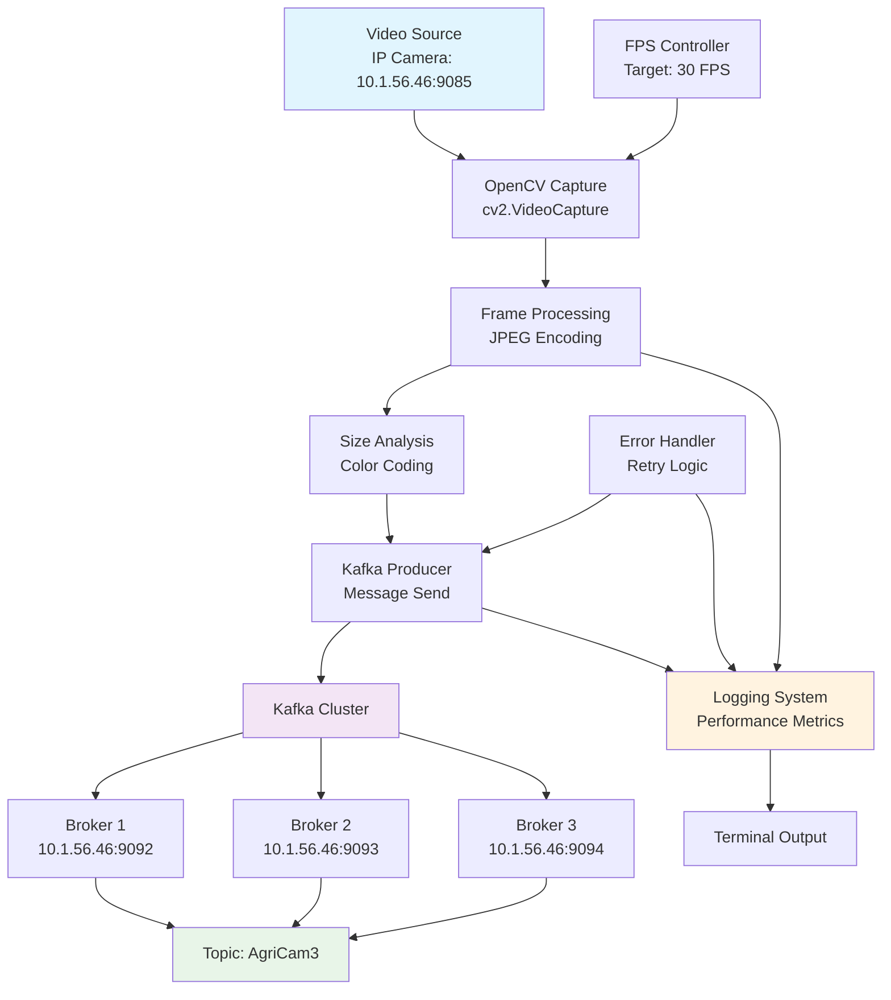

# Producer Operations Master Guide

*Comprehensive operations guide for the Kafka Video Frame Producer (22-Fps-Producer.py)*

---

## Table of Contents

1. [Architecture Overview](#architecture-overview)
2. [Component Details](#component-details)
3. [Quick Start Commands](#quick-start-commands)
4. [Navigation & File Operations](#navigation--file-operations)
5. [Environment Setup & Management](#environment-setup--management)
6. [Producer Operations](#producer-operations)
7. [Configuration Analysis](#configuration-analysis)
8. [Health Checks & Connectivity](#health-checks--connectivity)
9. [Performance Monitoring](#performance-monitoring)
10. [Log Management & Analysis](#log-management--analysis)
11. [Troubleshooting](#troubleshooting)
12. [Emergency Procedures](#emergency-procedures)
13. [File Management](#file-management)
14. [Quick Reference](#quick-reference)

---

## Architecture Overview



## Component Details

### Data Flow Architecture
1. **Video Capture**: Continuous frame capture from IP camera at 10.1.56.46:9085
2. **Frame Processing**: JPEG encoding with cv2.imencode() for compression
3. **Quality Control**: Frame size analysis with color-coded feedback
4. **Message Publishing**: Binary frame data sent to Kafka topic 'AgriCam3'
5. **Performance Monitoring**: Real-time FPS tracking and logging
6. **Error Recovery**: Automatic reconnection with exponential backoff

### Key Configuration Values
- **Kafka Brokers**: `10.1.56.46:9092,10.1.56.46:9093,10.1.56.46:9094`
- **Topic Name**: `AgriCam3`
- **Video Source**: `http://10.1.56.46:9085`
- **Target FPS**: `30`
- **Max Retries**: `5`
- **Log Frequency**: Every 100 frames

### Frame Size Color Coding
- **Green**: < 50 KB (Good compression)
- **Yellow**: 50-100 KB (Medium size)
- **Red**: > 100 KB (Large frames)

---

## Quick Start Commands

| Task | Command | Notes |
|------|---------|-------|
| **Start Producer** | `python3 22-Fps-Producer.py` | Runs in foreground with live output |
| **Background Start** | `python3 22-Fps-Producer.py > logs.txt 2>&1 &` | Runs in background, saves output |
| **Stop Producer** | `Ctrl+C` or `kill -SIGINT $(pgrep -f "22-Fps-Producer")` | Graceful shutdown |
| **Force Stop** | `pkill -9 -f "22-Fps-Producer"` | Emergency shutdown |
| **Check Status** | `ps aux | grep "22-Fps-Producer"` | See if producer is running |

---

## Navigation & File Operations

### Navigation Commands

| Command | Example Usage | Purpose | Type |
|---------|---------------|---------|------|
| `pwd` | `pwd` | Show current directory path | Navigation |
| `ls -la` | `ls -la` | List all files with details | Navigation |
| `cd ..` | `cd ..` | Go to parent directory | Navigation |
| `cd producer` | `cd producer` | Enter producer directory | Navigation |

### File Viewing Operations

| Command | Purpose | Example Output |
|---------|---------|----------------|
| `cat 22-Fps-Producer.py` | View entire script | Full Python code |
| `head -30 22-Fps-Producer.py` | View imports and setup | Import statements, logging config |
| `tail -30 22-Fps-Producer.py` | View main execution | `if __name__ == "__main__":` section |
| `grep -n "def " 22-Fps-Producer.py` | Find all functions | Line numbers of function definitions |
| `wc -l 22-Fps-Producer.py` | Count total lines in script | File Analysis |

### File Search Operations

| Command | Purpose | Expected Output |
|---------|---------|----------------|
| `grep -A3 -B1 "kafka_servers" 22-Fps-Producer.py` | Find Kafka config | `kafka_servers = '10.1.56.46:9092,10.1.56.46:9093,10.1.56.46:9094'` |
| `grep -A3 -B1 "topic" 22-Fps-Producer.py` | Find topic name | `topic = 'AgriCam3'` |
| `grep -A3 -B1 "video_stream_url" 22-Fps-Producer.py` | Find video source | `video_stream_url = "http://10.1.56.46:9085"` |
| `sed -n '115,125p' 22-Fps-Producer.py` | View main config block | Configuration section around line 115-125 |

---

## Environment Setup & Management

### Python Environment

| Command | Example Usage | Purpose | Type |
|---------|---------------|---------|------|
| `python3 --version` | `python3 --version` | Check Python version | Environment |
| `which python3` | `which python3` | Find Python3 executable path | Environment |
| `pip list` | `pip list` | Show all installed packages | Environment |
| `pip list | grep kafka` | `pip list | grep kafka` | Check if kafka-python is installed | Environment |
| `pip list | grep opencv` | `pip list | grep opencv` | Check if OpenCV is installed | Environment |
| `echo $PATH` | `echo $PATH` | Show system PATH variable | Environment Debug |

### Package Management

| Command | Example Usage | Purpose | Type |
|---------|---------------|---------|------|
| `pip install kafka-python` | `pip install kafka-python` | Install Kafka Python client | Package Management |
| `pip install opencv-python` | `pip install opencv-python` | Install OpenCV for video processing | Package Management |
| `pip install termcolor` | `pip install termcolor` | Install colored terminal output | Package Management |
| `pip check` | `pip check` | Check for package conflicts | Package Management |

### Dependency Testing

| Command | Purpose | Success Output |
|---------|---------|----------------|
| `python3 -c "import cv2; print('OpenCV:', cv2.__version__)"` | Test OpenCV | `OpenCV: 4.x.x.xx` |
| `python3 -c "import kafka; print('Kafka-python: OK')"` | Test Kafka client | `Kafka-python: OK` |
| `python3 -c "import termcolor; print('Termcolor: OK')"` | Test colored output | `Termcolor: OK` |
| `python3 -c "import cv2, kafka, termcolor; print('All imports OK')"` | Test all dependencies | `All imports OK` |

---

## Producer Operations

### Basic Execution

| Command | Example Usage | Purpose | Type |
|---------|---------------|---------|------|
| `python3 22-Fps-Producer.py` | `python3 22-Fps-Producer.py` | Start the video producer | Execution |
| `nohup python3 22-Fps-Producer.py &` | `nohup python3 22-Fps-Producer.py &` | Run producer in background | Execution |
| `python3 22-Fps-Producer.py > producer.log 2>&1 &` | `python3 22-Fps-Producer.py > producer.log 2>&1 &` | Run with output logging | Execution |
| `python3 -u 22-Fps-Producer.py` | `python3 -u 22-Fps-Producer.py` | Run with unbuffered output | Debug Execution |
| `python3 -v 22-Fps-Producer.py` | `python3 -v 22-Fps-Producer.py` | Run with verbose import info | Debug Execution |

### Process Management

#### Finding Producer Process

| Command | Purpose | Example Output |
|---------|---------|----------------|
| `ps aux | grep "22-Fps-Producer"` | Find process details | `user 12345 0.1 0.5 python3 22-Fps-Producer.py` |
| `pgrep -f "22-Fps-Producer"` | Get process ID only | `12345` |
| `ps -p $(pgrep -f "22-Fps-Producer") -o pid,ppid,%cpu,%mem,cmd` | Detailed process info | PID, CPU, memory usage |
| `ps -o pid,%mem,%cpu,cmd -p $(pgrep -f "22-Fps-Producer")` | Show detailed process stats | Performance |

#### Stopping Producer

| Command | Purpose | When to Use |
|---------|---------|-------------|
| `kill -SIGINT $(pgrep -f "22-Fps-Producer")` | Graceful shutdown | Normal operations |
| `kill -TERM $(pgrep -f "22-Fps-Producer")` | Termination signal | If SIGINT doesn't work |
| `kill -9 $(pgrep -f "22-Fps-Producer")` | Force kill | Emergency only |
| `pkill -f "22-Fps-Producer.py"` | Kill by script name | When multiple instances |

---

## Configuration Analysis

| Command | Example Usage | Purpose | Type |
|---------|---------------|---------|------|
| `grep -n "kafka_servers" 22-Fps-Producer.py` | `grep -n "kafka_servers" 22-Fps-Producer.py` | Find Kafka server configuration | Config Analysis |
| `grep -n "AgriCam3" 22-Fps-Producer.py` | `grep -n "AgriCam3" 22-Fps-Producer.py` | Find topic configuration | Config Analysis |
| `grep -n "fps=" 22-Fps-Producer.py` | `grep -n "fps=" 22-Fps-Producer.py` | Find FPS settings | Config Analysis |
| `grep -n "10.1.56.46" 22-Fps-Producer.py` | `grep -n "10.1.56.46" 22-Fps-Producer.py` | Find all IP addresses | Config Analysis |
| `sed -n '115,125p' 22-Fps-Producer.py` | `sed -n '115,125p' 22-Fps-Producer.py` | View main configuration section | Config Analysis |
| `awk '/kafka_servers/,/video_stream_url/' 22-Fps-Producer.py` | `awk '/kafka_servers/,/video_stream_url/' 22-Fps-Producer.py` | Extract configuration block | Config Analysis |

---

## Health Checks & Connectivity

### Network Connectivity Tests

#### Kafka Cluster Health

| Command | Purpose | Success Indicator | Failure Indicator |
|---------|---------|-------------------|-------------------|
| `ping 10.1.56.46` | Basic connectivity | `64 bytes from 10.1.56.46` | `Request timeout` |
| `telnet 10.1.56.46 9092` | Broker 1 port check | `Connected to 10.1.56.46` | `Connection refused` |
| `telnet 10.1.56.46 9093` | Broker 2 port check | `Connected to 10.1.56.46` | `Connection refused` |
| `telnet 10.1.56.46 9094` | Broker 3 port check | `Connected to 10.1.56.46` | `Connection refused` |
| `nc -zv 10.1.56.46 9092-9094` | All brokers at once | `succeeded!` for each port | `failed` messages |
| `nc -zv 10.1.56.46 9092` | Check if Kafka port is open | Network Health |

#### Video Stream Health

| Command | Purpose | Success Indicator | Failure Indicator |
|---------|---------|-------------------|-------------------|
| `curl -I http://10.1.56.46:9085` | Check stream availability | `HTTP/1.1 200 OK` | `Connection refused` or `404` |
| `curl -m 10 http://10.1.56.46:9085` | Test stream content | Video data output | `Timeout` or error |

### Health Check Sequence Script

```bash
# Quick health check script
echo "1. Testing Python environment..."
python3 -c "import cv2, kafka, termcolor; print('All imports OK')"

echo "2. Testing network connectivity..."
ping -c 1 10.1.56.46 > /dev/null && echo "Network OK" || echo "Network FAILED"

echo "3. Testing Kafka brokers..."
for port in 9092 9093 9094; do
  nc -zv 10.1.56.46 $port 2>&1 | grep -q "succeeded" && echo "Broker $port OK" || echo "Broker $port FAILED"
done

echo "4. Testing video stream..."
curl -s -I http://10.1.56.46:9085 | head -1 | grep -q "200 OK" && echo "Video stream OK" || echo "Video stream FAILED"
```

---

## Performance Monitoring

### System Resources

| Command | Purpose | Key Metrics |
|---------|---------|-------------|
| `top -pid $(pgrep -f "22-Fps-Producer")` | CPU/Memory usage | %CPU, %MEM columns |
| `iostat 1 5` | Disk I/O | Read/write activity |
| `netstat -i` | Network interface stats | TX/RX packets |
| `netstat -an | grep 9092` | Check Kafka connections | Network Performance |
| `df -h` | Disk space | Available space in current directory |
| `free -h` | Check memory usage (Linux) | System Performance |
| `lsof -p $(pgrep -f "22-Fps-Producer")` | Show open files/connections | Performance |

### Producer-Specific Metrics

| Command | Purpose | Information Provided |
|---------|---------|---------------------|
| `grep "Actual FPS" logs.txt | awk '{print $NF}' | tail -10` | Recent FPS values | Last 10 frame rates |
| `grep "Frame Size" logs.txt | grep -o "[0-9.]\+ KB" | tail -10` | Recent frame sizes | Last 10 frame sizes |
| `grep "Second:" logs.txt | tail -5` | Performance summary | Recent second-by-second stats |

---

## Log Management & Analysis

### Real-time Monitoring

| Command | Purpose | Use Case |
|---------|---------|----------|
| `tail -f logs.txt` | Follow live logs | Monitor running producer |
| `tail -f logs.txt | grep "FPS"` | Monitor performance only | Check frame rate |
| `tail -f logs.txt | grep "ERROR"` | Monitor errors only | Debug issues |
| `tail -f logs.txt | grep "Frame.*sent"` | Monitor frame transmission | Verify frames being sent |
| `tail -100 producer.log` | Show last 100 log lines | Log Viewing |
| `head -50 producer.log` | Show first 50 log lines | Log Viewing |

### Log Pattern Analysis

| Command | Purpose | What It Shows |
|---------|---------|---------------|
| `grep -c "ERROR" logs.txt` | Count errors | Total error occurrences |
| `grep "Actual FPS" logs.txt | tail -10` | Recent performance | Last 10 FPS measurements |
| `grep "Frame Size" logs.txt | tail -20` | Frame sizes | Recent frame size data |
| `grep "Kafka producer created" logs.txt` | Connection attempts | When producer connects |
| `grep "Retry" logs.txt` | Failed attempts | Connection retry events |
| `grep "ERROR" producer.log` | Find all error messages | Log Analysis |
| `grep "FPS" producer.log` | Find FPS performance logs | Log Analysis |
| `grep "Frame.*sent" producer.log` | Find frame transmission logs | Log Analysis |
| `grep -c "ERROR" producer.log` | Count total error occurrences | Log Analysis |
| `wc -l producer.log` | Count total log lines | Log Analysis |

### Log File Management

| Command | Purpose | When to Use |
|---------|---------|-------------|
| `ls -lh logs.txt` | Check log file size | Monitor disk usage |
| `> logs.txt` | Clear log file | When file gets too large |
| `mv logs.txt logs_$(date +%Y%m%d_%H%M).txt` | Archive logs | Before clearing |
| `tail -1000 logs.txt > recent_logs.txt` | Save recent logs | For troubleshooting |

### Common Log Patterns

| Log Message | Meaning | Action Required |
|-------------|---------|----------------|
| `Kafka producer created.` | Successful connection | None |
| `Frame X sent to Kafka topic: AgriCam3` | Normal operation | None |
| `Actual FPS: 29.XX` | Good performance | None |
| `Warning: Failed to capture frame.` | Video issue | Check video stream |
| `Error creating Kafka producer` | Connection problem | Check Kafka cluster |
| `Retry X/5` | Connection retrying | Monitor for recovery |
| `Shutdown signal received` | Graceful shutdown | Normal operation |

---

## Troubleshooting

### Environment Check

| Command | Purpose | Expected Result |
|---------|---------|----------------|
| `python3 --version` | Check Python version | `Python 3.x.x` |
| `which python3` | Find Python location | `/usr/bin/python3` or similar |
| `pip list | grep -E "kafka|opencv|termcolor"` | Check dependencies | All three packages listed |

### Dependency Testing Commands

| Command | Example Usage | Purpose | Type |
|---------|---------------|---------|------|
| `python3 -c "import cv2; print('OpenCV OK')"` | `python3 -c "import cv2; print('OpenCV OK')"` | Test OpenCV import | Dependency Check |
| `python3 -c "import kafka; print('Kafka OK')"` | `python3 -c "import kafka; print('Kafka OK')"` | Test Kafka import | Dependency Check |
| `python3 -c "import termcolor; print('Termcolor OK')"` | `python3 -c "import termcolor; print('Termcolor OK')"` | Test Termcolor import | Dependency Check |

### Quick Diagnostics

| Command | Purpose | What It Reveals |
|---------|---------|----------------|
| `python3 -u 22-Fps-Producer.py | head -20` | Test startup | Initial connection attempts |
| `timeout 30 python3 22-Fps-Producer.py` | 30-second test run | Basic functionality |
| `strace -e network python3 22-Fps-Producer.py 2>&1 | head -10` | Network system calls | Connection attempts (Linux) |

---

## Emergency Procedures

### Emergency Commands

| Command | Example Usage | Purpose | Type |
|---------|---------------|---------|------|
| `pkill -9 -f "22-Fps-Producer"` | `pkill -9 -f "22-Fps-Producer"` | Force kill all producer processes | Emergency |
| `killall python3` | `killall python3` | Kill all Python3 processes (use carefully) | Emergency |
| `sudo reboot` | `sudo reboot` | Restart entire system | Emergency |
| `sudo kill -9 -1` | `sudo kill -9 -1` | Kill all user processes (use very carefully) | Emergency |

### Complete System Reset

```bash
# 1. Stop all producer processes
pkill -9 -f "22-Fps-Producer"

# 2. Clear logs
> logs.txt

# 3. Test connectivity
ping -c 3 10.1.56.46

# 4. Restart producer
python3 22-Fps-Producer.py > logs.txt 2>&1 &

# 5. Verify startup
tail -f logs.txt
```

---

## File Management

| Command | Example Usage | Purpose | Type |
|---------|---------------|---------|------|
| `cp 22-Fps-Producer.py 22-Fps-Producer.py.backup` | `cp 22-Fps-Producer.py 22-Fps-Producer.py.backup` | Create backup of script | File Management |
| `ls -lh producer.log` | `ls -lh producer.log` | Check log file size | File Management |
| `> producer.log` | `> producer.log` | Clear log file content | File Management |
| `mv producer.log producer_$(date +%Y%m%d).log` | `mv producer.log producer_20240604.log` | Archive log with date | File Management |
| `find . -name "*.log" -mtime +7` | `find . -name "*.log" -mtime +7` | Find logs older than 7 days | File Management |
| `du -sh .` | `du -sh .` | Check total directory size | File Management |

---

## Quick Reference

### Expected Output Examples

```
2025-06-03 10:30:00,123 INFO Kafka producer created.
2025-06-03 10:30:00,456 INFO Frame 0 sent to Kafka topic: AgriCam3 (Second: 0) | Frame Size: 85.67 KB
Second: 0 | Frames Sent: 30 | Actual FPS: 29.98
```

### Monitoring Commands Summary

```bash
# Check Kafka topic
kafka-topics.sh --list --bootstrap-server 10.1.56.46:9092

# Monitor topic messages
kafka-console-consumer.sh --topic AgriCam3 --bootstrap-server 10.1.56.46:9092

# Check video stream
curl -I http://10.1.56.46:9085
```

### Performance Characteristics

#### System Requirements

| Resource | Minimum | Recommended |
|----------|---------|-------------|
| **CPU** | 2 cores | 4+ cores |
| **RAM** | 2GB | 4GB+ |
| **Network** | 10 Mbps | 100 Mbps+ |
| **Storage** | N/A (streaming only) | N/A |

#### Throughput Analysis


### Key Files and Paths

- **Main Script**: `22-Fps-Producer.py`
- **Log Files**: `logs.txt`, `producer.log`
- **Backup Pattern**: `22-Fps-Producer.py.backup`
- **Archived Logs**: `logs_YYYYMMDD_HHMM.txt`, `producer_YYYYMMDD.log`

### Important Notes

- Always use `Ctrl+C` or `SIGINT` for graceful shutdown
- Monitor frame sizes to ensure optimal compression
- Check FPS regularly to ensure target performance
- Keep log files manageable in size
- Create backups before making configuration changes
- Test dependencies after system updates

---

*This master guide combines all operational information for the Kafka Video Frame Producer. For technical architecture details, see README.md*

**Last Updated:** June 4, 2024  
**Component:** Producer Operations  
**Script Version:** 22-Fps-Producer.py  
**Guide Type:** Master Operations Reference

