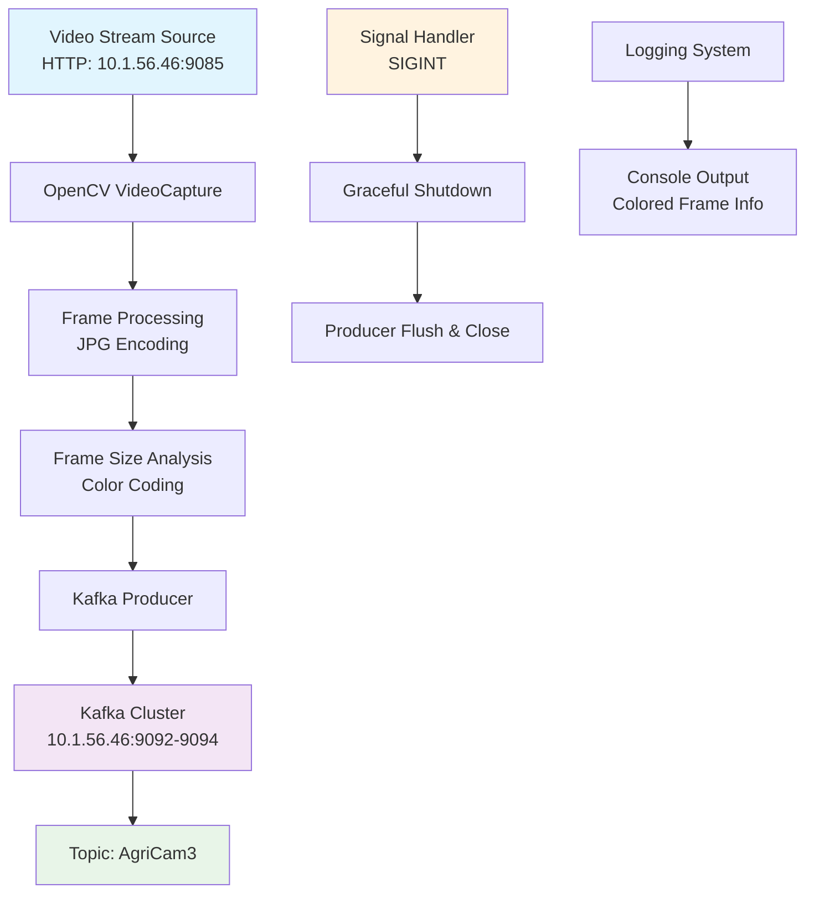
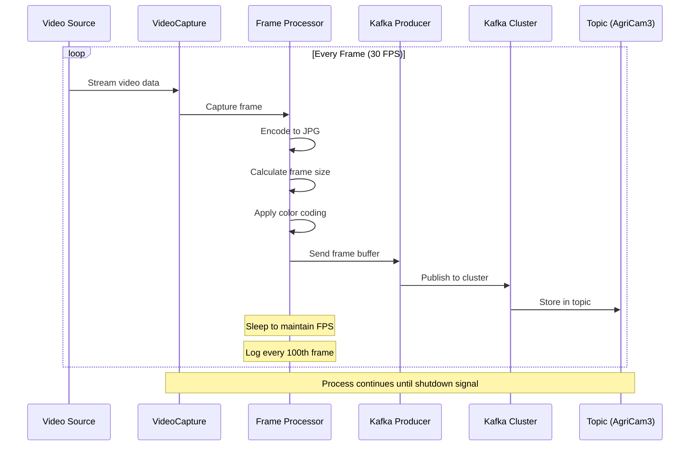
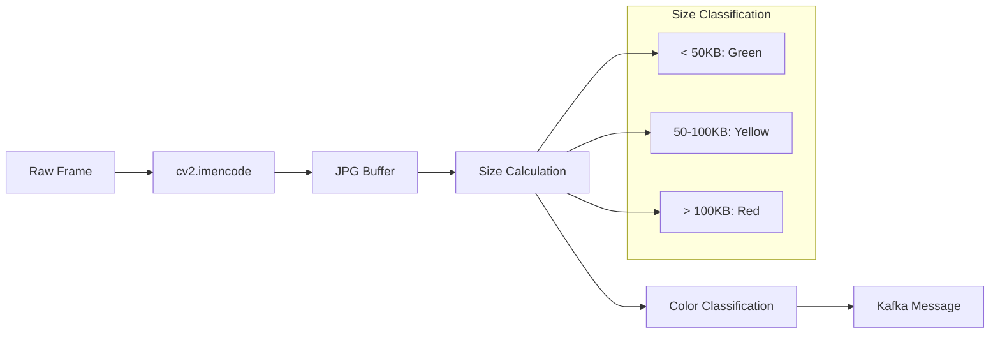
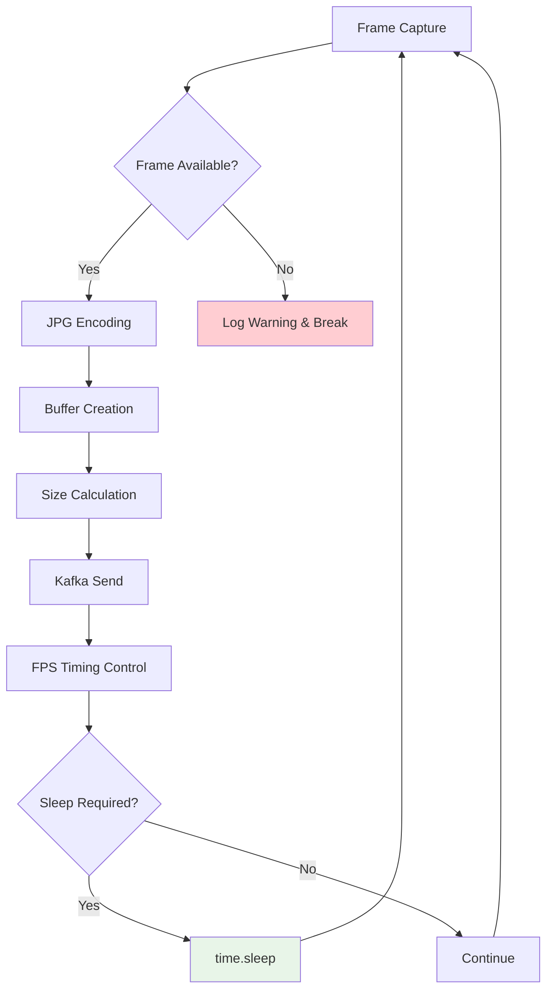

# Kafka Video Frame Producer - Technical Documentation

## Overview

The Kafka Video Frame Producer is a real-time video streaming application that captures video frames from a network stream and publishes them to Apache Kafka topics. This system is designed for distributed video processing pipelines, enabling real-time video analytics and processing across multiple consumers.

## Architecture Overview



## Data Flow Diagram



## System Configuration

### Kafka Cluster Configuration

| Parameter | Value | Description |
|-----------|-------|-------------|
| **Bootstrap Servers** | `10.1.56.46:9092,10.1.56.46:9093,10.1.56.46:9094` | Kafka cluster endpoints |
| **Topic Name** | `AgriCam3` | Target topic for video frames |
| **Replication Factor** | 3 (inferred from 3 brokers) | Data redundancy level |
| **Producer Type** | Asynchronous | Non-blocking message delivery |

### Video Stream Configuration

| Parameter | Value | Description |
|-----------|-------|-------------|
| **Source URL** | `http://10.1.56.46:9085` | HTTP video stream endpoint |
| **Target FPS** | 30 | Frames per second transmission rate |
| **Frame Encoding** | JPEG | Image compression format |
| **Color Space** | BGR (OpenCV default) | Color representation format |

### Performance Metrics

| Metric | Target Value | Monitoring |
|--------|--------------|------------|
| **Frame Rate** | 30 FPS | Real-time calculation and logging |
| **Frame Size Threshold** | < 50KB (Green), 50-100KB (Yellow), >100KB (Red) | Color-coded size monitoring |
| **Logging Frequency** | Every 100 frames | Reduced overhead logging |
| **Retry Attempts** | 5 maximum | Producer creation resilience |

## Technical Implementation Details

### Frame Processing Pipeline



### Error Handling and Resilience

| Component | Error Handling Strategy | Recovery Mechanism |
|-----------|------------------------|-------------------|
| **Video Capture** | Frame capture failure detection | Log warning, continue to next frame |
| **Kafka Producer** | Exponential backoff retry (2^n seconds) | Maximum 5 retries with progressive delay |
| **Signal Handling** | Graceful shutdown on SIGINT | Producer flush and close before exit |
| **Stream Interruption** | Automatic reconnection | 5-second delay before restart |

### Memory and Performance Optimization



## Code Structure and Components

### Main Functions

| Function | Purpose | Parameters | Return Value |
|----------|---------|------------|--------------|
| `send_video_frames()` | Core streaming logic | producer, topic, video_source, fps | None |
| `create_producer()` | Kafka producer initialization | kafka_servers, max_retries | KafkaProducer or None |
| `signal_handler()` | Graceful shutdown handler | signal, frame | System exit |

### Dependencies and Libraries

| Library | Version | Purpose |
|---------|---------|---------|
| **OpenCV (cv2)** | Latest | Video capture and frame processing |
| **kafka-python** | Latest | Kafka producer client |
| **termcolor** | Latest | Colored console output |
| **logging** | Built-in | System logging and monitoring |
| **signal** | Built-in | Signal handling for graceful shutdown |
| **time** | Built-in | Timing control and FPS management |

## Logging and Monitoring

### Log Levels and Messages

| Level | Message Type | Example |
|-------|--------------|---------|
| **INFO** | System status | "Kafka producer created." |
| **WARNING** | Non-critical issues | "Warning: Failed to capture frame." |
| **ERROR** | Recoverable errors | "Error creating Kafka producer" |
| **CRITICAL** | System failures | "Failed to create Kafka producer after 5 retries" |

### Performance Monitoring Output

```
Second: 0 | Frames Sent: 30 | Actual FPS: 30.00
Frame 100 sent to Kafka topic: AgriCam3 (Second: 3) | Frame Size: 75.32 KB
```

## Installation and Setup

### Prerequisites

```bash
# Install required Python packages
pip install opencv-python kafka-python termcolor

# Verify Kafka cluster connectivity
telnet 10.1.56.46 9092
telnet 10.1.56.46 9093
telnet 10.1.56.46 9094
```

### Environment Configuration

| Variable | Value | Description |
|----------|-------|-------------|
| **KAFKA_SERVERS** | `10.1.56.46:9092,10.1.56.46:9093,10.1.56.46:9094` | Kafka bootstrap servers |
| **VIDEO_STREAM_URL** | `http://10.1.56.46:9085` | Source video stream |
| **TOPIC_NAME** | `AgriCam3` | Kafka topic name |
| **TARGET_FPS** | `30` | Desired frame rate |

## Usage Instructions

### Basic Execution

```bash
python 22-Fps-Producer.py
```

### Expected Output

```
2025-06-03 10:30:00,123 INFO Kafka producer created.
2025-06-03 10:30:00,456 INFO Frame 0 sent to Kafka topic: AgriCam3 (Second: 0) | Frame Size: 85.67 KB
Second: 0 | Frames Sent: 30 | Actual FPS: 29.98
```

## Performance Characteristics

### System Requirements

| Resource | Minimum | Recommended |
|----------|---------|-------------|
| **CPU** | 2 cores | 4+ cores |
| **RAM** | 2GB | 4GB+ |
| **Network** | 10 Mbps | 100 Mbps+ |
| **Storage** | N/A (streaming only) | N/A |

### Throughput Analysis


## Troubleshooting Guide

### Common Issues and Solutions

| Issue | Symptoms | Solution |
|-------|----------|----------|
| **Connection Failure** | "Could not open video source" | Verify video stream URL accessibility |
| **Kafka Unavailable** | "Error creating Kafka producer" | Check Kafka cluster status and network connectivity |
| **Low FPS** | Actual FPS < Target FPS | Reduce frame quality or increase processing resources |
| **High Memory Usage** | System slowdown | Monitor frame sizes and optimize encoding |

### Monitoring Commands

```bash
# Check Kafka topic
kafka-topics.sh --list --bootstrap-server 10.1.56.46:9092

# Monitor topic messages
kafka-console-consumer.sh --topic AgriCam3 --bootstrap-server 10.1.56.46:9092

# Check video stream
curl -I http://10.1.56.46:9085
```

## Security Considerations

| Aspect | Implementation | Recommendation |
|--------|---------------|----------------|
| **Network Security** | Plain HTTP/TCP | Implement SSL/TLS for production |
| **Authentication** | None | Add SASL/SCRAM for Kafka |
| **Data Encryption** | None | Encrypt sensitive video content |
| **Access Control** | None | Implement ACLs for topic access |

## Future Enhancements

- **Multi-stream Support**: Handle multiple video sources simultaneously
- **Dynamic FPS Adjustment**: Adaptive frame rate based on network conditions
- **Compression Optimization**: Advanced encoding algorithms for better compression
- **Health Monitoring**: Integration with monitoring systems (Prometheus, Grafana)
- **Containerization**: Docker support for easy deployment
- **Configuration Management**: External configuration files for different environments

---

**Version**: 1.0  
**Last Updated**: June 2025  
**Maintainer**: Development Team  
**License**: [Specify License]
